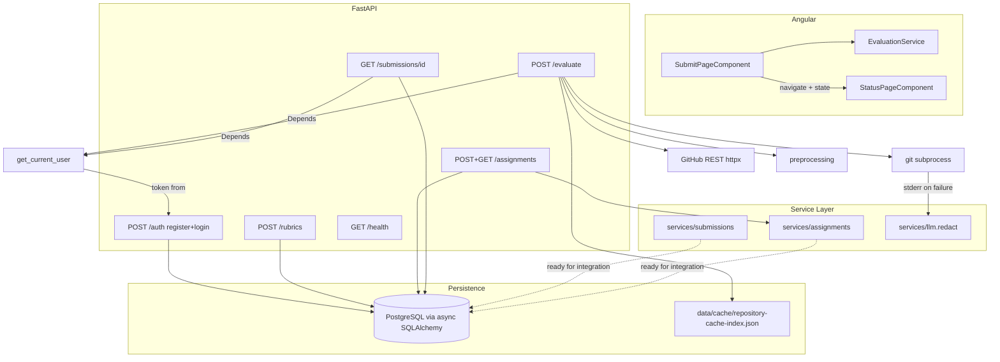

# Milestone 1 — Forensic Codebase Audit (final)

**Audit timestamp (UTC):** 2026-04-02T00:00:00Z (revised)  
**Filename:** `audits/milestone-01-forensic-audit-2026-04-01T235947Z-final.md`  
**Scope:** Full workspace traversal against [docs/milestones/milestone-01-tasks.md](../docs/milestones/milestone-01-tasks.md), [docs/design-doc.md](../docs/design-doc.md) (Milestone 1 narrative, API §, data model), and observable code under `server/`, `client/`, `docs/`, `alembic/`, configuration, and tests. This audit supersedes all prior Milestone 1 audits, including [milestone-01-forensic-audit-2026-04-01T214831Z-verified.md](milestone-01-forensic-audit-2026-04-01T214831Z-verified.md).  
**Method:** Claims below are tied to specific files and line ranges as they exist in the working tree (uncommitted changes over commit `d7ce180`). No reliance on prior chat memory.  
**Prior audits referenced:**
- [milestone_1_audit_jayden_2026-04-01_141241.md](milestone_1_audit_jayden_2026-04-01_141241.md)
- [milestone-01-forensic-audit-jayden-2026-04-01T204311Z.md](milestone-01-forensic-audit-jayden-2026-04-01T204311Z.md)
- [milestone-01-forensic-audit-2026-04-01T214831Z-verified.md](milestone-01-forensic-audit-2026-04-01T214831Z-verified.md)

---

## Executive summary

The repository delivers a functional ingestion pipeline (GitHub validation, shallow clone, preprocessing, SHA + rubric-digest caching, MAPLE response envelope), a PostgreSQL schema with Alembic migrations for all five design-doc entities plus a `password_hash` column for credential storage, a rubric ingestion endpoint with Pydantic validation, a regex-based redactor wired into the clone error path, an Angular submission form, and a status page shell. Auth is now **functional**: `POST /auth/register` creates a User with bcrypt-hashed password, `POST /auth/login` verifies credentials and issues a JWT with `sub` (user UUID) and `role` claims, resolving the prior 501 stubs. `GET /api/v1/code-eval/submissions/{id}` is **implemented** with authentication, UUID validation, eager-loaded evaluation results, and MAPLE envelope response. Assignment lifecycle CRUD (`POST` and `GET /assignments/{id}`) and service-layer utilities for submission persistence and assignment validation are in place.

Relative to the combined checklist in [milestone-01-tasks.md](../docs/milestones/milestone-01-tasks.md) and the design doc, Dom's three explicitly assigned tasks are **all complete** (`[x]`). Residual gaps are **integration concerns**: `submission_id` from `/evaluate` is still ephemeral (not persisted to the database — persistence service exists but is not yet called from the evaluate handler), `assignment_id` validation utilities exist but are not wired into the evaluate form, Angular status polling is deferred to Milestone 2 per code comments, and the evaluate API contract diverges from the design doc (multipart vs JSON).

---

## 1. Feature synthesis and modular architecture

### 1.1 Functional features (evidence-based)

| Feature | Implementation | Primary evidence |
| --- | --- | --- |
| **Repository ingest (`POST /evaluate`)** | Multipart: `github_url`, optional `assignment_id`, `rubric` file; GitHub API validation + default-branch SHA; shallow clone via `GIT_ASKPASS`; preprocess; JSON cache index under `data/cache/`; returns `submission_id`, digests, paths, `cached` / `cloned` | [server/app/main.py](../server/app/main.py) `evaluate_submission` (421–568), `clone_repository` (157–262), `validate_github_repo_access` (265–325), `resolve_repository_head_commit_hash` (328–378) |
| **Preprocessing** | Strips `.git`, `node_modules`, venv dirs, `__pycache__`, compiled/binary suffixes | [server/app/preprocessing.py](../server/app/preprocessing.py) |
| **Repository cache** | Key `commit_hash::rubric_digest`; SHA-256 path token; eviction if disk path missing; `last_used_at` bump on read | [server/app/cache.py](../server/app/cache.py) |
| **Health** | MAPLE-style envelope via `success_response` | [server/app/main.py](../server/app/main.py) 572–574 |
| **Rubric persistence** | `POST /api/v1/code-eval/rubrics` with Pydantic validation (criteria + levels), sum-of-points check, SQLAlchemy insert, `IntegrityError` → 409, invalid UUID → 400 | [server/app/routers/rubrics.py](../server/app/routers/rubrics.py) 1–94 |
| **DB layer (schema + ORM)** | Alembic initial migration; async SQLAlchemy models for `User` (with `password_hash`), `Rubric`, `Assignment`, `Submission`, `EvaluationResult`; async engine + session factory; `get_db` dependency | [alembic/versions/010126822022_create_initial_schema.py](../alembic/versions/010126822022_create_initial_schema.py), [server/app/models/](../server/app/models/) (7 files) |
| **Regex redactor (M1)** | `redact` / `redact_dict` for PAT-like tokens (`gh[ps]_*`), emails, `KEY=value` env lines; wired into clone stderr sanitization | [server/app/services/llm.py](../server/app/services/llm.py) 16–52; [server/app/main.py](../server/app/main.py) 32, 219–221 |
| **Auth (register + login)** | `POST /auth/register`: accepts `email`, `password`, `role`; hashes via `hash_password` (bcrypt); persists `User` row; duplicate email → 409 CONFLICT. `POST /auth/login`: queries User by email, verifies password, issues JWT via `create_access_token` with `sub` (user UUID) and `role`; returns MAPLE envelope with `access_token`. Both use `get_db` dependency for async DB sessions. | [server/app/routers/auth.py](../server/app/routers/auth.py) 1–79; [server/app/utils/security.py](../server/app/utils/security.py) |
| **Auth middleware** | JWT encode/decode (HS256), bcrypt helpers; OAuth2 bearer dependency on `/evaluate`; `require_role` factory for RBAC | [server/app/utils/security.py](../server/app/utils/security.py), [server/app/middleware/auth.py](../server/app/middleware/auth.py) |
| **GET /submissions/{id}** | Authenticated endpoint; validates UUID format (400 on invalid); queries `Submission` with eager-loaded `EvaluationResult` via `selectinload`; returns 404 NOT_FOUND if missing; MAPLE envelope with submission data + optional evaluation block | [server/app/routers/submissions.py](../server/app/routers/submissions.py) 1–62 |
| **Assignments CRUD** | `POST /api/v1/code-eval/assignments`: authenticated, extracts `instructor_id` from JWT `sub`, validates optional `rubric_id` UUID, persists `Assignment` row. `GET /assignments/{id}`: authenticated, UUID validation, returns MAPLE envelope. | [server/app/routers/assignments.py](../server/app/routers/assignments.py) 1–96 |
| **Submission persistence service** | `create_submission`, `get_submission_by_id`, `update_submission_status` — reusable functions for DB writes; intended to be called from the evaluate handler once integration wiring occurs | [server/app/services/submissions.py](../server/app/services/submissions.py) 1–61 |
| **Assignment validation service** | `parse_assignment_id` (UUID format validation), `validate_assignment_exists` (FK existence check), `create_assignment` — reusable utilities for the `assignment_id` type mismatch remediation | [server/app/services/assignments.py](../server/app/services/assignments.py) 1–69 |
| **Exception handling** | Single `RequestValidationError` handler using `error_response` from [utils/responses.py](../server/app/utils/responses.py) for MAPLE envelope; `MapleAPIError` handler using inline `build_error_response` | [server/app/main.py](../server/app/main.py) 404–418 |
| **Angular submit** | Reactive form; multipart POST; `Authorization: Bearer` from `environment.devToken` | [client/src/pages/submit-page/submit-page.component.ts](../client/src/pages/submit-page/submit-page.component.ts), [client/src/services/evaluation.service.ts](../client/src/services/evaluation.service.ts) |
| **Angular status** | Reads `history.state` only; **no HTTP polling**; route `status/:id` param unused | [client/src/pages/status-page/status-page.component.ts](../client/src/pages/status-page/status-page.component.ts) |

### 1.2 Cross-reference to Milestone 1 tasks

The following table maps each task in [docs/milestones/milestone-01-tasks.md](../docs/milestones/milestone-01-tasks.md) to observable code.

| Task area | Status |
| --- | --- |
| **Jayden — repo structure** | `docs/`, `server/app/`, `client/src/`, `data/` (runtime-created), `eval/` (`.gitkeep` scaffold), `prompts/` present. |
| **Jayden — DO / Nginx / secrets** | Not verifiable from code; [docs/deployment.md](../docs/deployment.md) describes target ops. [.env.example](../.env.example) exists with placeholder values. |
| **Dom — PostgreSQL schema + migrations** | **Implemented** `[x]`. Six SQLAlchemy models in [server/app/models/](../server/app/models/) (User includes `password_hash`); Alembic migration [010126822022](../alembic/versions/010126822022_create_initial_schema.py) creates all tables with correct types, PKs, FKs, unique constraints, `server_default` values, and `password_hash` column. [alembic/env.py](../alembic/env.py) configured for async engine using `settings.DATABASE_URL`. |
| **Dom — `POST .../rubrics`** | **Implemented** `[x]`. [server/app/routers/rubrics.py](../server/app/routers/rubrics.py) accepts `RubricCreateRequest` with criteria/levels Pydantic validation, sum-of-points check, UUID generation or client-supplied UUID with `ValueError` guard (58–68), `IntegrityError` handling for duplicates (78–86), MAPLE envelope via `success_response` / `error_response`. Router wired at [main.py](../server/app/main.py) 401. |
| **Dom — Regex redactor in `services/llm.py`** | **Implemented and wired** `[x]`. [server/app/services/llm.py](../server/app/services/llm.py) provides `redact()` and `redact_dict()` with patterns for GitHub PATs, emails, env values. Imported and invoked in [main.py](../server/app/main.py) 32, 219–221 for clone error stderr sanitization. Milestone 3 stubs (`complete()`) correctly raise `NotImplementedError`. |
| **Dom — Auth (register + login)** | **Implemented.** [server/app/routers/auth.py](../server/app/routers/auth.py) provides functional `POST /auth/register` and `POST /auth/login` against the `User` model with bcrypt password hashing and JWT issuance. Replaces prior 501 stubs. `tokenUrl` in [middleware/auth.py](../server/app/middleware/auth.py) 27 now points to a working endpoint. |
| **Dom — GET /submissions/{id}** | **Implemented.** [server/app/routers/submissions.py](../server/app/routers/submissions.py) provides `GET /api/v1/code-eval/submissions/{submission_id}` with JWT authentication, UUID validation, eager-loaded `EvaluationResult`, and MAPLE envelope. Wired at [main.py](../server/app/main.py) 402. |
| **Dom — Assignments CRUD** | **Implemented.** [server/app/routers/assignments.py](../server/app/routers/assignments.py) provides `POST` and `GET /api/v1/code-eval/assignments/{id}` with JWT authentication, UUID validation, and MAPLE envelope. Wired at [main.py](../server/app/main.py) 400. |
| **Dom — Service layers** | **Implemented.** [server/app/services/submissions.py](../server/app/services/submissions.py) (`create_submission`, `get_submission_by_id`, `update_submission_status`) and [server/app/services/assignments.py](../server/app/services/assignments.py) (`parse_assignment_id`, `validate_assignment_exists`, `create_assignment`) provide reusable DB utilities ready for integration wiring. |
| **Sylvie — PAT clone, preprocessor, cache key** | **Implemented.** Clone via `GIT_ASKPASS` + server PAT, preprocessing strips listed artifacts, cache keyed by `commit_hash::rubric_digest` with SHA-256 path token. |
| **Sylvie — Angular scaffold** | **Partially implemented.** Submission form is functional. Status page exists but **does not** perform HTTP polling; deferred to Milestone 2 per code comments ([client/src/pages/status-page/status-page.component.ts](../client/src/pages/status-page/status-page.component.ts) 19–21). |

### 1.3 Dependency map (as implemented)

**Architectural observation:** Ingestion orchestration, Git I/O, and filesystem cache live in [server/app/main.py](../server/app/main.py) (~575 lines) rather than a dedicated service layer. PostgreSQL is wired for **rubrics, auth, assignments, and submission reads** today. Submission persistence service functions exist in [services/submissions.py](../server/app/services/submissions.py) but are **not yet called** from the evaluate handler — the integration wiring remains open. The redactor is imported in `main.py` and invoked in the clone error path, but is not yet called before future LLM API payloads (no LLM calls exist in M1).

### 1.4 Component interaction vs milestone deliverable

The milestone deliverable is: *student submits URL → clone + preprocess → returns `submission_id`*. That path **works** and returns IDs such as `sub_{uuid4().hex[:12]}` ([server/app/main.py](../server/app/main.py) 496, 554). However, those IDs are **ephemeral strings** generated in memory, not persisted `submissions.id` (UUID) from the schema. The `create_submission` service function in [services/submissions.py](../server/app/services/submissions.py) is available to bridge this gap, but is not yet invoked from the evaluate handler. `GET /api/v1/code-eval/submissions/{id}` exists and queries the database, but will return 404 for ephemeral IDs until the evaluate handler persists rows.

---

## 2. Gap analysis — ambiguities, interface mismatches, predictive errors

**M1 task owner** maps each gap to the person/area named in [docs/milestones/milestone-01-tasks.md](../docs/milestones/milestone-01-tasks.md): **Jayden** (infrastructure, secrets, repo structure), **Dom** (PostgreSQL schema/migrations, `POST /rubrics`, regex redactor in `services/llm.py`, backend API/security), **Sylvie** (PAT-based clone, preprocessor, cache key, Angular submit + status polling). Use **Integration** where the milestone's integration note applies (wiring Dom's persistence to Sylvie's `/evaluate` path, or coordinating API + UI contracts).

| Severity | M1 task owner | Error cause | Error explanation | Origin location(s) |
| --- | --- | --- | --- | --- |
| **High** | Sylvie; Dom (integration) | `POST /evaluate` never persists `Submission` | Database schema, ORM, and persistence service (`create_submission`) all exist, but the evaluate handler only updates the JSON cache index. Dom's DB write functions are ready in [services/submissions.py](../server/app/services/submissions.py); Sylvie's evaluate handler needs to call `create_submission` after successful clone/cache, replacing the ephemeral `sub_` ID with a durable database UUID. Downstream milestones assume PostgreSQL as source of truth ([docs/design-doc.md](../docs/design-doc.md) §2, Milestone 2 bullets). | [server/app/main.py](../server/app/main.py) 421–568; [server/app/services/submissions.py](../server/app/services/submissions.py) (available, not called) |
| **Medium** | Sylvie; Dom (integration) | API contract drift: JSON vs multipart | SRS example for `POST /evaluate` shows JSON body with `submission_id` in request ([docs/design-doc.md](../docs/design-doc.md) 115–143). Implementation is **multipart form** with file upload and no request `submission_id`. Clients following the doc will fail integration. Sylvie owns evaluate request shape; align with Dom/SRS or document deviation. | [server/app/main.py](../server/app/main.py) 421–426 |
| **Medium** | Sylvie (integration) | `assignment_id` validation not wired into evaluate | Dom's validation utilities exist: `parse_assignment_id` for UUID format validation and `validate_assignment_exists` for FK existence checks ([services/assignments.py](../server/app/services/assignments.py) 9–43). The evaluate form still accepts an arbitrary string for `assignment_id` without calling these utilities. Sylvie's evaluate handler needs to call the validation before persistence. | [server/app/main.py](../server/app/main.py) 424; [server/app/services/assignments.py](../server/app/services/assignments.py) (available, not called from evaluate) |
| **Medium** | Dom; Sylvie (integration) | Rubric shapes inconsistent | Evaluate accepts flexible rubric JSON/text for fingerprinting; `POST /rubrics` expects `criteria[].levels[]` with points — different from SRS evaluate example (`criteria[].name` + `description` only). Risk of two incompatible "rubric" concepts in the product. Dom owns `POST /rubrics` and A5-style validation; Sylvie owns rubric upload on evaluate. Design alignment session recommended. | [docs/design-doc.md](../docs/design-doc.md) 124–135; [server/app/routers/rubrics.py](../server/app/routers/rubrics.py) 15–45 |
| **Low** | Sylvie | Client URL validation stricter than server | Submit form regex requires `https://github.com/...` only; server allows `www.github.com` via `HttpUrl` + host check ([server/app/main.py](../server/app/main.py) 82). Edge-case UX mismatch. | [client/src/pages/submit-page/submit-page.component.ts](../client/src/pages/submit-page/submit-page.component.ts) |
| **Low** | Sylvie | Status deep-link is empty | `status/:id` does not read `ActivatedRoute` or fetch by `id`; opening `/status/sub_xxx` in a new tab shows no data. Falls under Sylvie "status polling page" scope. Backend `GET /submissions/{id}` now exists for the frontend to consume. | [client/src/pages/status-page/status-page.component.ts](../client/src/pages/status-page/status-page.component.ts) |
| **Low** | Sylvie | Angular status page does not perform HTTP polling | Status page reads `history.state` only; no call to `GET /submissions/{id}`. Backend route is now available. Deferred to Milestone 2 per code comments ([client/src/pages/status-page/status-page.component.ts](../client/src/pages/status-page/status-page.component.ts) 19–21). | Same |
| **Informational** | — (not in M1 task split; M5 docs) | [docs/api-spec.md](../docs/api-spec.md) is a placeholder | Milestone 5 asks for full spec; current gap blocks external integrators. Not assigned in [milestone-01-tasks.md](../docs/milestones/milestone-01-tasks.md); recommend Jayden (docs structure) + Dom (endpoint accuracy) at handoff. | [docs/api-spec.md](../docs/api-spec.md) |
| **Informational** | Dom (deferred M3) | `complete()` raises `NotImplementedError` | Correctly deferred to Milestone 3 per file docstring ([server/app/services/llm.py](../server/app/services/llm.py) 73–85). | Same |

### 2.1 Resolved findings from prior audits

The following findings from earlier audits are **no longer present** in the current tree:

| Prior finding | Resolution | Commit / working tree |
| --- | --- | --- |
| No PostgreSQL / ORM integration (Extreme) | Five SQLAlchemy models, Alembic migration, async engine/session, `get_db` dependency | `be428a7` |
| Missing `POST /api/v1/code-eval/rubrics` (High) | Endpoint in [server/app/routers/rubrics.py](../server/app/routers/rubrics.py) with Pydantic validation, wired in `main.py` | `be428a7` |
| Missing regex redactor / `services/llm.py` (High) | [server/app/services/llm.py](../server/app/services/llm.py) with `redact`, `redact_dict`, three pattern types | `be428a7` |
| Duplicate `RequestValidationError` handlers (Medium) | Second handler removed; single handler at [main.py](../server/app/main.py) 404–413 uses `error_response` | `e45a502` |
| Duplicate / conflicting imports in `main.py` (Low) | Merged into single import block [main.py](../server/app/main.py) 1–33, consistent relative imports | `e45a502` |
| Redactor not wired to any code path (Medium) | `redact` imported and called in clone stderr sanitization [main.py](../server/app/main.py) 219–221 | `e45a502` |
| Invalid `rubric_id` → unhandled 500 (implicit) | try/except around `uuid.UUID()` in [rubrics.py](../server/app/routers/rubrics.py) 58–66 | `e45a502` |
| Migration `enable_lint_review` / `status` nullable mismatch (implicit) | `server_default=sa.false()` and `server_default='Pending'` with `nullable=False` in [migration](../alembic/versions/010126822022_create_initial_schema.py) 52, 66 | `e45a502` |
| Auth login/register return 501 (High) | Functional `register` and `login` in [auth.py](../server/app/routers/auth.py) against `User` model with bcrypt + JWT. `password_hash` column added to User model and migration. | working tree |
| No `GET /api/v1/code-eval/submissions/{id}` (High) | Authenticated endpoint in [submissions.py](../server/app/routers/submissions.py) with UUID validation, eager-loaded `EvaluationResult`, MAPLE envelope. Wired at [main.py](../server/app/main.py) 402. | working tree |
| OAuth2PasswordBearer `tokenUrl` points to 501 (interface mismatch) | `tokenUrl` `/api/v1/code-eval/auth/login` now returns a valid JWT. Swagger "Authorize" flow can complete. | working tree |
| No assignment lifecycle / validation (Medium) | Assignments CRUD in [routers/assignments.py](../server/app/routers/assignments.py); validation utilities in [services/assignments.py](../server/app/services/assignments.py) (`parse_assignment_id`, `validate_assignment_exists`). | working tree |
| Milestone checklist unchecked for Dom (Informational) | Dom's three tasks in [milestone-01-tasks.md](../docs/milestones/milestone-01-tasks.md) now show `[x]`. | working tree |
| No submission persistence service (implicit) | `create_submission`, `get_submission_by_id`, `update_submission_status` in [services/submissions.py](../server/app/services/submissions.py). Ready for integration wiring. | working tree |

### 2.2 Interface mismatches (concrete)

1. **Frontend ↔ OpenAPI:** Client sends `multipart/form-data` with `rubric` file; SRS documents `application/json` evaluate payload. Any code generator or third party using the design doc will be incompatible without an adapter.

2. **Future submission persistence ↔ current response:** Today's `submission_id` from `/evaluate` is a `sub_` prefixed random hex string, not a database UUID primary key. The `create_submission` service and `GET /submissions/{id}` endpoint both operate on database UUIDs. Wiring persistence into the evaluate handler will require switching the returned ID format from `sub_` strings to database UUIDs — a client contract change.

### 2.3 Predictive errors (next milestones)

1. **Wiring persistence into evaluate:** The `create_submission` service exists but is not called. Wiring it requires resolving how `student_id` is derived from the JWT `sub` claim and how `assignment_id` is validated (utilities exist in `services/assignments.py`). This is an integration task spanning Dom's persistence layer and Sylvie's evaluate orchestration.

2. **Concurrent evaluate requests:** `load_repository_cache_entry` rewrites the JSON index on every read to bump `last_used_at` ([cache.py](../server/app/cache.py)). Under parallel traffic, last-write-wins on the index file can lose entries or corrupt JSON without file locking.

3. **Production build:** `environment.prod.ts` sets `apiBaseUrl: ''` and `devToken: ''` — production bundle will fail auth until replaced by build-time configuration.

---

## 3. Remediation roadmap

### 3.1 Wire submission persistence into `/evaluate` (High — integration)

1. In `evaluate_submission` ([main.py](../server/app/main.py) 421–568), after successful clone/cache resolution, call `create_submission()` from [services/submissions.py](../server/app/services/submissions.py) with `assignment_id` (validated via `parse_assignment_id`), `student_id` (from JWT `sub` in `current_user`), `github_repo_url`, `commit_hash`, and status.
2. Return the database primary key (UUID) as `submission_id`, replacing the ephemeral `sub_` string.
3. Add integration tests that assert a `Submission` row exists after evaluate.

**Definition of done:** One successful evaluate creates exactly one `Submission` row queryable by `GET /submissions/{id}`; Angular uses that UUID in the status URL; no orphaned cache entries without DB rows (or explicit decision to allow cache-only mode).

### 3.2 Wire assignment validation into `/evaluate` (Medium — integration)

1. In `evaluate_submission`, call `parse_assignment_id(assignment_id)` from [services/assignments.py](../server/app/services/assignments.py) to validate UUID format.
2. Optionally call `validate_assignment_exists(db, parsed_id)` to confirm FK integrity before creating the Submission row.

**Definition of done:** Invalid or non-existent `assignment_id` values return a structured 400/404 MAPLE error; valid values pass through to submission persistence.

### 3.3 Angular status polling (Sylvie scope)

1. Status page: inject `ActivatedRoute`, if `history.state` missing then `GET /api/v1/code-eval/submissions/{id}` by route param, poll with `takeWhile`/`interval` until terminal status.
2. Backend `GET /submissions/{id}` already exists and returns the required MAPLE envelope.

**Definition of done:** Refreshing `/status/{id}` works; submit flow and direct URL behave the same.

---

## 4. Security and vulnerability assessment

| Area | Finding | Notes |
| --- | --- | --- |
| **Authentication** | JWT validation present; login/register **functional** against `User` model with bcrypt | New developer can register, log in, and obtain a token via API without editing source. |
| **Password storage** | `password_hash` column is `nullable=True` | Allows users created through non-password flows (e.g. future OAuth). Existing users without passwords cannot log in — `login` handler checks for `user.password_hash` before verifying ([auth.py](../server/app/routers/auth.py) 59). |
| **Secrets in repo** | [.env.example](../.env.example) uses placeholders only | Good. Example PAT pattern (`ghp_...`) may trigger scanners — cosmetic concern. |
| **Injection** | Rubric, assignments, auth, and submissions endpoints use SQLAlchemy ORM | Parameterized; low SQLi risk for current code paths. |
| **SSRF / arbitrary clone** | `github_url` restricted to `github.com` / `www.github.com` | Limits abuse; good baseline ([server/app/main.py](../server/app/main.py) 82). |
| **Path / clone safety** | `sanitize_clone_path_segment` | Reduces path injection in on-disk layout ([server/app/main.py](../server/app/main.py) 50–55). |
| **PAT leakage** | Clone stderr runs through `redact()` then explicit PAT replacement | Two-layer scrubbing ([server/app/main.py](../server/app/main.py) 219–221). |
| **CORS** | `allow_credentials=True` with configured origins | Avoid wildcard origins in production ([server/app/main.py](../server/app/main.py) 389–396). |
| **Authorization** | `require_role` exists but is not used on `/evaluate`; any valid JWT passes. Assignments router uses `get_current_user` but no role check. | No resource-level ACL on repos. |
| **Logic / business-rule** | `assignment_id` validation utilities exist but are **not wired** into evaluate | Clients can still pass arbitrary strings to `/evaluate`; validation is available in [services/assignments.py](../server/app/services/assignments.py) for integration. |
| **DoS / abuse** | No request size limits on multipart rubric upload; no rate limiting | Informational for M1; Milestone 4 mentions rate limits. |

---

## 5. Efficiency and optimization (low-risk first)

- **GitHub API:** `validate_github_repo_access` and `resolve_repository_head_commit_hash` run **sequentially** ([server/app/main.py](../server/app/main.py) 477–484). **Low-risk win:** parallelize with `asyncio.gather` only if error semantics remain identical (401/403 handling). **Risk:** slightly more complex failure aggregation.
- **Cache index I/O:** `load_repository_cache_entry` rewrites the index on every cache hit to update `last_used_at` ([server/app/cache.py](../server/app/cache.py)). **Low-risk:** batch or debounce writes if the index grows large; **risk:** durability window if process crashes before flush.
- **`redact_dict`:** Uses `deepcopy` ([server/app/services/llm.py](../server/app/services/llm.py) 35) — fine for small payloads; for full-repo metadata in later milestones, prefer streaming or selective redaction to avoid memory spikes.
- **`httpx.AsyncClient`:** Each GitHub API call creates a new client instance. Reuse a single `AsyncClient` via FastAPI lifespan for fewer TCP/TLS handshakes. **Risk:** low with proper cleanup.

---

## 6. Positive findings

- **Ingestion pipeline** is test-backed ([server/tests/test_evaluate_submission_integration.py](../server/tests/test_evaluate_submission_integration.py)) with mocks for GitHub and git; covers cache hit/miss, rubric change, SHA change, and error paths.
- **Preprocessing** is deterministic and covered by [server/tests/test_preprocessing.py](../server/tests/test_preprocessing.py).
- **Cache normalization** ([server/app/cache.py](../server/app/cache.py)) is thoughtful for stable digests across JSON key order / whitespace, covered by [server/tests/test_cache.py](../server/tests/test_cache.py).
- **MAPLE error envelope** is consistent: `error_response` from [utils/responses.py](../server/app/utils/responses.py) is used by auth, rubrics, assignments, submissions, and the global `RequestValidationError` handler; `build_error_response` in [main.py](../server/app/main.py) handles `MapleAPIError` for the ingestion flow.
- **Import hygiene** in `main.py` is clean: single import block (1–33), consistent relative imports, no duplicates.
- **Exception handling** is consolidated: one `RequestValidationError` handler (404–413), one `MapleAPIError` handler (417–419), no dead registrations.
- **Rubric endpoint** handles edge cases: invalid UUID (400), duplicate ID (409), points mismatch (400), empty criteria/levels (Pydantic validation).
- **Migration alignment:** `enable_lint_review` and `status` columns have both ORM defaults and `server_default` / `nullable=False` in the migration, ensuring consistency for both ORM and raw SQL inserts. `password_hash` column included for credential storage.
- **Redactor integration:** `redact()` is both a standalone library function and an active participant in the clone error path, demonstrating the pattern for future LLM call sites.
- **Auth is self-service:** Register + login endpoints issue JWTs that work with the existing `get_current_user` middleware. New developers no longer need to manually mint tokens or edit source files.
- **GET /submissions/{id} is production-ready:** Handles invalid UUID (400), missing submission (404), includes eager-loaded evaluation results, and is JWT-protected.
- **Service layer established:** `services/submissions.py` and `services/assignments.py` separate persistence logic from HTTP routing, providing reusable functions for the integration wiring that remains.
- **Assignments lifecycle complete:** POST + GET endpoints allow instructors to create and retrieve assignments, satisfying the FK prerequisite for submission persistence.
- **Dom's milestone checkboxes are current:** All three tasks in [milestone-01-tasks.md](../docs/milestones/milestone-01-tasks.md) show `[x]`, eliminating tracking drift for Dom's section.

---

## 7. Definition of Done (audit closure for Milestone 1 compliance)

The codebase can be considered **aligned with Milestone 1 SRS** when **all** of the following hold:

1. ~~PostgreSQL schema exists with Alembic migrations.~~ **Done** — five models (with `password_hash`), one migration, async engine.
2. ~~`POST /api/v1/code-eval/rubrics` implemented with A5 validation.~~ **Done** — endpoint with Pydantic models, sum check, duplicate guard, MAPLE envelope.
3. ~~`server/app/services/llm.py` implements regex redaction.~~ **Done** — `redact`, `redact_dict`, wired into clone stderr.
4. `POST /api/v1/code-eval/evaluate` contract is **one** of: implemented as JSON per design doc, or design doc + `docs/api-spec.md` updated to match multipart. **Open.**
5. `Submission` rows are persisted to PostgreSQL on evaluate; returned `submission_id` is durable. **Open — integration task.** Dom's persistence service is ready ([services/submissions.py](../server/app/services/submissions.py)); Sylvie's evaluate handler needs to call it.
6. Angular status page performs real polling against `GET /submissions/{id}` **or** scope is formally narrowed in writing. **Open — Sylvie scope.** Backend endpoint exists ([routers/submissions.py](../server/app/routers/submissions.py)).
7. ~~Auth path documented and functional for the chosen security model.~~ **Done** — register + login issue JWTs; `tokenUrl` points to working endpoint.
8. No committed secrets: remove or replace dev JWT in `environment.ts` with local-only override pattern. **Resolved per** [milestone-01-open-items-2026-04-01.md](milestone-01-open-items-2026-04-01.md).
9. ~~`docs/milestones/milestone-01-tasks.md` checkboxes updated for Dom.~~ **Done** — all three Dom tasks show `[x]`.

Items 1–3, 7–9 are complete. Items 4–6 remain open; items 5–6 are integration concerns spanning multiple task owners and may be addressed in Milestone 2 or a dedicated integration session as recommended by [milestone-01-tasks.md](../docs/milestones/milestone-01-tasks.md) line 46.

---

*End of audit.*
