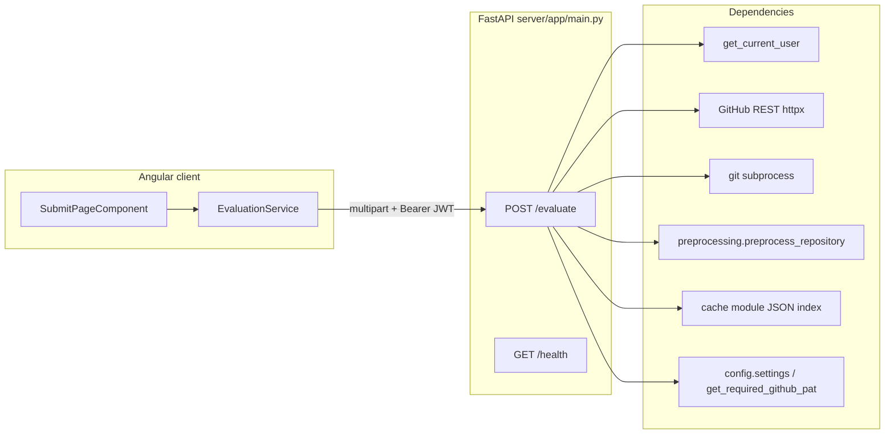

# Milestone 1 — Forensic Codebase Audit vs SRS

**Auditor:** Jayden  
**Audit date:** 2026-04-01 (UTC 2026-04-01T20:43:11Z, filename token `2026-04-01T204311Z`)  
**Scope:** Full workspace traversal against [docs/milestones/milestone-01-tasks.md](../docs/milestones/milestone-01-tasks.md), [docs/design-doc.md](../docs/design-doc.md) (Milestone 1 narrative, API §, data model), and observable code under `server/`, `client/`, `docs/`, configuration, and tests.  
**Method:** Claims below are tied to specific files and line ranges as they existed at audit time; no reliance on prior chat memory.

---

## Executive summary

The repository delivers a **coherent ingestion slice**: GitHub repository validation, shallow clone with server-side PAT, preprocessing, SHA + normalized rubric digest caching, and a MAPLE-style response envelope for `POST /api/v1/code-eval/evaluate`. An **Angular client** exists for multipart submission and a **status page** that displays navigation state (not true polling).

**Milestone 1 is not fully satisfied** relative to the combined checklist in `milestone-01-tasks.md` and the design doc: **PostgreSQL schema and Alembic migrations are absent**, **`POST /api/v1/code-eval/rubrics` is absent**, **`services/llm.py` (regex redactor) is absent**, **auth login/register are explicit 501 stubs** while **`/evaluate` requires a JWT**, **`submission_id` is ephemeral** (not persisted), **`GET /api/v1/code-eval/submissions/{id}` is absent**, and the **public API contract for `evaluate` diverges** from the design doc (multipart file upload vs JSON body). Infrastructure checklist items (DigitalOcean, Nginx, etc.) are **process/deployment** items not verifiable from source alone; [docs/deployment.md](../docs/deployment.md) documents intended procedures.

---

## 1. Feature synthesis and modular architecture

### 1.1 Functional features observed in code

| Feature | Behavior | Evidence |
|--------|----------|----------|
| **Evaluate / ingest** | Multipart: `github_url`, optional `assignment_id`, required `rubric` file; validates GitHub URL shape; fingerprints rubric; resolves default-branch commit via GitHub API; cache lookup; clone + preprocess or cache hit; returns `submission_id`, paths, digests | `server/app/main.py` — handler `evaluate_submission` at lines 416–563; helpers `validate_github_repo_access` (264–324), `resolve_repository_head_commit_hash` (327–377), `clone_repository` (156–261) |
| **Preprocessing** | Strips `.git`, `node_modules`, `venv`/`.venv`, `__pycache__`; removes files with compiled/binary suffixes | `server/app/preprocessing.py` — `STRIP_DIRECTORY_NAMES`, `COMPILED_BINARY_SUFFIXES`, `preprocess_repository` (53–86) |
| **Repository cache** | Key `commit_hash::rubric_digest`; path token from SHA-256; JSON index; eviction if on-disk path missing; updates `last_used_at` on read | `server/app/cache.py` — `build_repository_cache_key` (57–72), `load_repository_cache_entry` (75–95), `fingerprint_rubric_content` (48–54) |
| **Health** | JSON envelope with `status` and `environment` | `server/app/main.py` lines 566–568 |
| **Auth scaffold** | JWT create/decode (HS256), bcrypt helpers; OAuth2 bearer dependency; **login/register return 501** | `server/app/utils/security.py`; `server/app/middleware/auth.py` (`get_current_user`, 29–59); `server/app/routers/auth.py` (16–30) |
| **CORS** | Configurable origins; credentials allowed | `server/app/main.py` 388–395; `server/app/config.py` 60–76 |
| **Angular submit flow** | Reactive form: GitHub URL, optional assignment ID, required rubric file; POST with `Bearer` from `environment.devToken` | `client/src/pages/submit-page/submit-page.component.ts`; `client/src/services/evaluation.service.ts` |
| **Angular status UI** | Shows data from `history.state` only; no HTTP polling | `client/src/pages/status-page/status-page.component.ts` (15–22); template `status-page.component.html` (34–38) |

### 1.2 Cross-reference to Milestone 1 tasks (`milestone-01-tasks.md`)

| Task area | Status vs checklist |
|-----------|---------------------|
| **Jayden — repo structure** | `docs/`, `server/app/`, `client/src/`, `data/` (with `raw/`, `processed/`, `.gitkeep`), `eval/` (`.gitkeep` trees), `prompts/` present. `data/cache/` is not committed (created at runtime; see `main.py` `CACHE_INDEX_PATH`). |
| **Jayden — DO / Nginx / secrets** | Not verifiable from code; [docs/deployment.md](../docs/deployment.md) describes target ops. [.env.example](../.env.example) exists. |
| **Dom — PostgreSQL schema + migrations** | **Not implemented** — no `alembic.ini`, no `server/app/models`, no SQLAlchemy usage in application code despite dependencies in [server/requirements.txt](../server/requirements.txt). |
| **Dom — `POST .../rubrics`** | **Not implemented** — no router; only design references. |
| **Dom — Regex redactor in `services/llm.py`** | **Not implemented** — no `server/app/services/` package. |
| **Sylvie — PAT clone, preprocessor, cache key, Angular** | Clone + preprocess + cache: **implemented**. Angular form + status page: **implemented**; **status polling** as specified is **not** implemented (TODO in component). |

### 1.3 Dependency map (as implemented)

**There is no data access layer or service layer** separating persistence from HTTP: orchestration logic, Git operations, and cache I/O live in `main.py`. This is acceptable for a skeleton but is **architectural drift** from the SRS diagram implying PostgreSQL as the primary persistence for submissions.

### 1.4 Component interaction (milestone objective: “returns `submission_id`”)

The end-to-end path **does** return a `submission_id` string on success (`main.py` 491, 549–551). However, that ID is **only generated in memory** and **never written to a database**, so it cannot anchor future `GET /submissions/{id}` or instructor workflows described in the design doc.

---

## 2. Gap analysis — ambiguities, interface mismatches, predictive errors

| Severity | Error cause | Error explanation | Origin location(s) |
| :--- | :--- | :--- | :--- |
| **Extreme** | No PostgreSQL / ORM integration | Milestone 1 Dom tasks require SQLAlchemy migrations for `User`, `Assignment`, `Rubric`, `Submission`, `EvaluationResult`. `DATABASE_URL`, `SECRET_KEY`, and `GITHUB_PAT` are **required** at settings load, but **no engine, session, or models** consume the database. Downstream milestones assume durable entities and foreign keys. | [server/app/config.py](../server/app/config.py) 35–37, 87–89; absence of `alembic*` under `server/` (verified glob); no `models` package |
| **Extreme** | Ephemeral `submission_id` | Each successful evaluate allocates `sub_{uuid4().hex[:12]}` without persistence. Cache hits also mint a **new** submission id (`main.py` 491–504). Any future poll or audit keyed by `submission_id` will not find a canonical row; duplicates refer to the same cached tree. | [server/app/main.py](../server/app/main.py) 491, 549–551 |
| **High** | Auth dependency without issuance path | `evaluate_submission` depends on `get_current_user` (JWT). `/auth/login` and `/auth/register` return **501 NOT_IMPLEMENTED** (`routers/auth.py`). Operators must manually mint JWTs (documented in client environment comments). This is a **broken self-service loop** for students and invalidates “auth scaffold” as an end-user-ready feature. | [server/app/main.py](../server/app/main.py) 416–421; [server/app/routers/auth.py](../server/app/routers/auth.py) 16–30; [client/src/environments/environment.ts](../client/src/environments/environment.ts) 4–9 |
| **High** | API contract mismatch (evaluate) | Design doc specifies `POST /api/v1/code-eval/evaluate` with **JSON** body (`submission_id`, `github_url`, `assignment_id`, `rubric` object, `options`). Implementation uses **multipart form** + **file upload** for rubric. Clients or integrators following the SRS will send the wrong content-type and fail validation. | [docs/design-doc.md](../docs/design-doc.md) 115–164; [server/app/main.py](../server/app/main.py) 416–422 |
| **High** | Missing `GET /api/v1/code-eval/submissions/{id}` | SRS and user story “Asynchronous processing visibility” imply polling. Milestone 1 Sylvie tasks list a **status polling page**. Backend route **does not exist**; status page only reads router state; refresh/deep link shows placeholder. | [docs/design-doc.md](../docs/design-doc.md) 166–170; [client/src/pages/status-page/status-page.component.ts](../client/src/pages/status-page/status-page.component.ts) 19–21; [client/src/pages/status-page/status-page.component.html](../client/src/pages/status-page/status-page.component.html) 35–37 |
| **High** | Missing `POST /api/v1/code-eval/rubrics` | Explicit Dom Milestone 1 deliverable; A5 schema validation not present. | [docs/milestones/milestone-01-tasks.md](../docs/milestones/milestone-01-tasks.md) 26–28 |
| **High** | Missing regex redactor (`services/llm.py`) | Milestone 1 design milestone list requires redaction before external calls. No module exists; stderr from `git` is string-replaced for PAT only on clone failure, not a general redaction pipeline for future LLM/logging. | [docs/design-doc.md](../docs/design-doc.md) 484; absence of `server/app/services/llm.py` |
| **Medium** | Server PAT vs per-student PAT semantics | SRS user stories emphasize students’ repos verified with **Personal Access Tokens** (student-scoped). Implementation uses a **single server `GITHUB_PAT`** for API + clone. Private repos the PAT cannot read will fail; student-supplied tokens are not modeled. This is a **product/security model gap** relative to narrative, not necessarily a bug if intentional for M1. | [docs/design-doc.md](../docs/design-doc.md) 16, 24; [server/app/main.py](../server/app/main.py) 463–470, 472–478 |
| **Medium** | `DATABASE_URL` required though unused | Application cannot start without a valid `DATABASE_URL` string even when no DB code runs, increasing friction for “ingestion-only” local demos and inviting placeholder secrets. | [server/app/config.py](../server/app/config.py) 35–37 |
| **Medium** | `docs/api-spec.md` placeholder | Official API surface for integrators is undocumented in-repo; only OpenAPI from FastAPI and design doc (which disagrees on evaluate). | [docs/api-spec.md](../docs/api-spec.md) |
| **Low** | `submission_id` in design sample vs implementation | Design JSON example includes `submission_id` **in the request** for evaluate; server generates id and does not accept client-provided id. | [docs/design-doc.md](../docs/design-doc.md) 119–121 vs [server/app/main.py](../server/app/main.py) 416–422 |
| **Low** | GitHub URL validation strictness | `parse_github_repo_url` requires exactly `owner/repo` (lines 84–88). URLs with `/tree/...`, trailing `.git`, or enterprise hosts are rejected or partially handled (`www.github.com` allowed at 81). | [server/app/main.py](../server/app/main.py) 80–97 |
| **Low** | Angular URL regex vs backend | Client pattern is slightly narrower than backend (e.g. case, trailing slash handling). Edge-case mismatch possible. | [client/src/pages/submit-page/submit-page.component.ts](../client/src/pages/submit-page/submit-page.component.ts) 15–18 |
| **Informational** | Milestone checklist markdown | All tasks in `milestone-01-tasks.md` remain `- [ ]` unchecked even where partial implementation exists — tracking drift. | [docs/milestones/milestone-01-tasks.md](../docs/milestones/milestone-01-tasks.md) |
| **Informational** | `eval/` and results conventions | Scaffold `.gitkeep` dirs exist; no automated eval scripts tied to M1 ingestion in this audit scope. | `eval/results/.gitkeep`, etc. |

### 2.1 Interface mismatches (concrete)

1. **Frontend ↔ OpenAPI:** Client sends `multipart/form-data` with `rubric` file; SRS documents `application/json` evaluate payload. Any code generator or third party using the design doc will be incompatible without an adapter.

2. **Future `GET /submissions/{id}` ↔ current response:** Today’s `submission_id` is not a database primary key. Wiring a GET handler without first persisting submissions will force a **throwaway in-memory dict** or a **breaking change** to id semantics.

3. **OAuth2PasswordBearer `tokenUrl`:** Points to `/api/v1/code-eval/auth/login` which returns 501. Swagger “Authorize” flow cannot complete.

### 2.2 Predictive errors (next milestones)

1. **Adding DB after the fact:** Random `submission_id` generation and cache-only bookkeeping will require a **migration story** for existing cache index rows (no `submission_id` column today).

2. **Concurrent evaluate requests:** `load_repository_cache_entry` rewrites the JSON index on every read to bump `last_used_at` ([cache.py](../server/app/cache.py) 92–95). Under parallel traffic, **last-write-wins** on the index file can lose entries or corrupt JSON without file locking.

3. **Production build:** [client/src/environments/environment.prod.ts](../client/src/environments/environment.prod.ts) sets `apiBaseUrl: ''` and `devToken: ''` — **production bundle will fail auth** until replaced by build-time configuration.

---

## 3. Remediation roadmap (High / Extreme)

### 3.1 Extreme: PostgreSQL + Alembic + durable `Submission`

**Steps**

1. Add `server/app/db.py` (async engine/session factory) using `settings.DATABASE_URL`.
2. Define SQLAlchemy 2.x models matching design-doc §Data Model (minimal columns for M1: at least `Submission` with `id`, `github_repo_url`, `commit_hash`, `assignment_id` nullable, `status`, `local_repo_path`, `rubric_digest`, timestamps).
3. Initialize Alembic under `server/`; first revision creates tables.
4. In `evaluate_submission`, insert/update `Submission` before returning; use **stable** `submission_id` (UUID or DB id string).
5. On cache hit, either reuse the same submission row for idempotency policy **or** document new row per attempt — product decision required.

**Definition of Done:** `alembic upgrade head` applies cleanly on empty DB; integration test runs evaluate against test DB (or transactions) and asserts a row exists retrievable by returned id; server still starts when migrations are applied.

### 3.2 Extreme / High: Align `submission_id` with persistence

**Steps**

1. Stop generating throwaway ids on cache hit without DB backing; return id tied to stored record **or** return idempotent id derived from `(commit_hash, rubric_digest, assignment_id)` only if explicitly chosen and documented.

**Definition of Done:** Same `submission_id` can be used with `GET /submissions/{id}` in Milestone 2 without redesign.

### 3.3 High: Close the auth loop

**Options (pick one strategy)**

- **A (minimal):** Implement `login` against a seed user or `User` table with `create_access_token`; document default dev user in README (dev only).
- **B (M1-scoped):** Remove JWT from `/evaluate` behind `settings.APP_ENV == "development"` or a separate **API key** header for ingestion, and document threat model for server PAT.

**Definition of Done:** Fresh clone + `uvicorn` + Angular dev: student can submit **without** hand-editing JWT strings.

### 3.4 High: Implement `POST /api/v1/code-eval/rubrics`

**Steps**

1. Add Pydantic models + version-pinned JSON Schema (A5) validation.
2. Persist to `Rubric` table (after models exist).
3. Return MAPLE envelope consistent with [server/app/utils/responses.py](../server/app/utils/responses.py).

**Definition of Done:** Contract tests with valid/invalid payloads; 400 on schema violation.

### 3.5 High: Add `services/llm.py` redactor stub

**Steps**

1. Create `server/app/services/llm.py` with `redact_for_external(text: str) -> str` applying regexes for PAT-like tokens, emails, env var patterns.
2. Call from any path that will emit to LLM or logs in future; unit tests with fixtures.

**Definition of Done:** Test coverage for known leak patterns; imported from a single module (no copy-paste).

### 3.6 High: Reconcile API documentation

**Steps**

1. Update [docs/design-doc.md](../docs/design-doc.md) **or** change implementation to JSON evaluate — **one source of truth**.
2. Expand [docs/api-spec.md](../docs/api-spec.md) with actual multipart schema, auth header, and error codes.

**Definition of Done:** A new developer can integrate using only `docs/api-spec.md` without reading Python.

---

## 4. Security and vulnerability assessment

### 4.1 Relative to Milestone 1 scope

| Topic | Finding |
|-------|---------|
| **SQL injection** | Not applicable — no SQL execution in app code. |
| **XSS** | Angular default interpolation escapes content; status/submit templates bind text — **low risk** if future `innerHTML` is avoided. |
| **Authentication** | JWT validation is present (`decode_access_token` in [security.py](../server/app/utils/security.py) 25–32). **Weak `SECRET_KEY` in dev** ([.env.example](../.env.example) `changeme`) is an operational risk if reused in production. |
| **Authorization** | `require_role` exists but **is not used** on `/evaluate`; any valid JWT passes. No resource-level ACL on repos. |
| **Secrets in repo** | [.env.example](../.env.example) uses placeholders only — **good**. [client/src/environments/environment.ts](../client/src/environments/environment.ts) contains a **committed JWT** — if paired with a known or default `SECRET_KEY`, this is credential leakage; even otherwise it encourages copying tokens into VCS. **Treat as High** for public repos. |
| **GitHub PAT exposure** | PAT passed via env to subprocess ([main.py](../server/app/main.py) 183–190); clone failure scrubs PAT substring in stderr (218–219). PAT still exists in process environment during clone — standard tradeoff; document minimization (fine-scoped PAT, org secrets). |
| **SSRF** | `github_url` restricted to `github.com` host — mitigates arbitrary URL fetch; **good** for this endpoint. |
| **DoS / abuse** | No request size limits documented on multipart rubric upload; no rate limiting in app (Milestone 4 mentions limits). **Informational** for M1. |
| **CORS** | `allow_credentials=True` with configurable origins — avoid `*` in production ([docs/deployment.md](../docs/deployment.md) aligns). |

### 4.2 Logic / business-rule gaps

- **No binding** between `assignment_id` and a real `Assignment` row — clients can pass arbitrary strings; server accepts and stores in cache metadata only ([cache.py](../server/app/cache.py) `assignment_id` on entry). Instructors cannot enforce “valid assignment” server-side.

---

## 5. Efficiency and optimization (low-risk, high-reward first)

| Suggestion | Benefit | Risk |
|------------|---------|------|
| **Debounce or remove `last_used_at` write on every cache read** | Reduces JSON index churn and concurrent write contention | **Low** if `last_used_at` is non-critical for M1; **Medium** if product later relies on accurate LRU |
| **Reuse single `httpx.AsyncClient` (lifespan)** | Fewer TCP/TLS handshakes for GitHub API double-call per request | **Low** with proper cleanup; requires small FastAPI lifespan refactor |
| **Short-circuit: single GitHub API call** if `repos/{owner}/{repo}` response already includes `default_branch` and you can resolve SHA without second request | Cuts latency and rate-limit usage | **Medium** — must confirm API fields meet correctness vs current `commits/{branch}` call |
| **Explicit `max_length` / file size on `UploadFile`** | Prevents large rubric uploads exhausting disk/RAM | **Low**; choose limit with product |

**Avoid (until contracts stable):** aggressive refactoring of `main.py` into services without first fixing persistence and API contract — high chance of merge conflict with Dom/Sylvie work.

---

## 6. Positive findings (objective)

- **Ingestion pipeline** is test-backed ([server/tests/test_evaluate_submission_integration.py](../server/tests/test_evaluate_submission_integration.py)) with mocks for GitHub and git; covers cache hit/miss, rubric change, SHA change, and error paths.
- **MAPLE error envelope** is consistent between `build_error_response` in `main.py` and `error_response` in [responses.py](../server/app/utils/responses.py) for auth stubs.
- **Preprocessing** is deterministic and covered by [server/tests/test_preprocessing.py](../server/tests/test_preprocessing.py).
- **Cache normalization** ([cache.py](../server/app/cache.py) 153–196) is thoughtful for stable digests across JSON key order / whitespace.

---

## 7. Definition of Done (audit closure for Milestone 1 compliance)

The codebase can be considered **aligned with Milestone 1 SRS** when **all** of the following hold:

1. PostgreSQL schema exists with Alembic migrations; `Submission` (and minimally related entities per team split) persist across restarts.  
2. `POST /api/v1/code-eval/evaluate` contract is **one** of: implemented as JSON per design doc, or design doc + `docs/api-spec.md` updated to match multipart.  
3. `POST /api/v1/code-eval/rubrics` implemented with A5 validation.  
4. `server/app/services/llm.py` (or agreed path) implements regex redaction with tests.  
5. Auth path documented and functional for the chosen security model (JWT login or dev bypass + production strategy).  
6. Angular status page performs **real** polling against `GET /api/v1/code-eval/submissions/{id}` **or** Milestone 1 scope is formally narrowed in writing (reconciliation doc).  
7. No committed secrets: remove or replace dev JWT in `environment.ts` with local-only override pattern (e.g. `environment.development.local.ts` gitignored).  
8. `docs/milestones/milestone-01-tasks.md` checkboxes updated to reflect reality.

---

*End of audit.*
