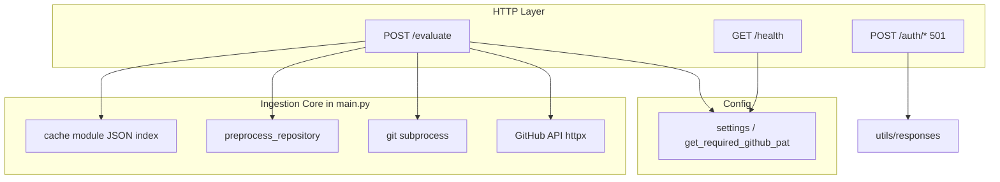

# Milestone 1 forensic audit (codebase vs SRS)

**Sources of truth used:** [docs/milestones/milestone-01-tasks.md](docs/milestones/milestone-01-tasks.md), [docs/design-doc.md](docs/design-doc.md) §8 Milestone 1, [docs/resources/maple-a1.md](docs/resources/maple-a1.md), and every Python module under [server/app/](server/app/). [docs/api-spec.md](docs/api-spec.md) is a three-line placeholder. Milestone checklist items in `milestone-01-tasks.md` are **all still unchecked** (`- [ ]`), which matches the implementation gaps below.

---

## 1. Feature synthesis and modular architecture

### 1.1 What exists (verified in repo)

| Area                        | Implementation                                                                                                                                                                                                                                        | Primary files                                                                                                                                                                          |
| --------------------------- | ----------------------------------------------------------------------------------------------------------------------------------------------------------------------------------------------------------------------------------------------------- | -------------------------------------------------------------------------------------------------------------------------------------------------------------------------------------- |
| **Ingestion API**           | `POST /api/v1/code-eval/evaluate` accepts `github_url`, optional `assignment_id`, and `rubric` (dict/list/str); returns MAPLE-style envelope with `submission_id`, `rubric_digest`, `status` (`cloned` / `cached`), `local_repo_path`, `commit_hash`. | [server/app/main.py](server/app/main.py) (e.g. `SubmissionRequest` ~97–117, handler ~435–546)                                                                                          |
| **GitHub access**           | REST calls to validate repo and resolve default-branch HEAD SHA; clone via `git` + `GIT_ASKPASS` script with PAT from env; stderr PAT redaction on clone failure.                                                                                     | [server/app/main.py](server/app/main.py) `validate_github_repo_access` ~283–343, `resolve_repository_head_commit_hash` ~346–396, `clone_repository` ~175–280                           |
| **Pre-processing**          | Removes `.git`, `node_modules`, `venv`/`.venv`, `__pycache__`; deletes files with compiled/binary suffixes.                                                                                                                                           | [server/app/preprocessing.py](server/app/preprocessing.py)                                                                                                                             |
| **Cache**                   | Key = `commit_hash::rubric_digest` (SHA-256 of normalized rubric); JSON index under `data/cache/repository-cache-index.json`; stale entry eviction if path missing.                                                                                   | [server/app/cache.py](server/app/cache.py)                                                                                                                                             |
| **Health**                  | `GET /api/v1/code-eval/health`                                                                                                                                                                                                                        | [server/app/main.py](server/app/main.py) ~549–551                                                                                                                                      |
| **Auth scaffold (partial)** | JWT helpers (bcrypt + PyJWT), OAuth2 bearer dependency, role checker; **login/register return 501** with MAPLE error envelope.                                                                                                                        | [server/app/utils/security.py](server/app/utils/security.py), [server/app/middleware/auth.py](server/app/middleware/auth.py), [server/app/routers/auth.py](server/app/routers/auth.py) |
| **Config**                  | Pydantic-settings: required `DATABASE_URL`, `SECRET_KEY`, `GITHUB_PAT`; CORS list; `.env` paths.                                                                                                                                                      | [server/app/config.py](server/app/config.py)                                                                                                                                           |
| **Tests**                   | Unit/integration coverage for evaluate flow, cache, preprocessing (mocked GitHub/clone).                                                                                                                                                              | [server/tests/](server/tests/)                                                                                                                                                         |
| **Docs / prompts**          | Design doc, deployment, milestone tasks, Sylvie prompts, checkpoint summary.                                                                                                                                                                          | [docs/](docs/), [prompts/](prompts/)                                                                                                                                                   |

### 1.2 What does not exist in the workspace (verified)

- **No** `client/src/` (Angular) — glob over `client/`** returned **zero** files.
- **No** Alembic/SQLAlchemy models/migrations — no `alembic.ini`, no `**/alembic`* under repo root (excluding `venv`).
- **No** `POST /api/v1/code-eval/rubrics` — grep shows only documentation references.
- **No** `server/app/services/llm.py` (or any `services/`) — Regex Redactor is **not** implemented.
- **No** `eval/` tree per MAPLE conventions (no `eval/test-cases/`, etc.).
- **No** populated `data/` tree in workspace listing (`.gitignore` ignores `data/raw/`*, `data/cache/`*; presence of `.gitkeep` is implied by ignore rules but not required for this audit).

### 1.3 Dependency map (actual, not target)

**Architectural observation:** There is **no** Data Access Layer or Service layer boundary—the evaluate handler orchestrates GitHub, git, preprocessing, and cache **inline** in [server/app/main.py](server/app/main.py) (~400+ lines). That is acceptable for a skeleton but diverges from the design doc’s long-term picture (PostgreSQL, `services/llm.py`, Docker). There is also **no** use of [server/app/middleware/auth.py](server/app/middleware/auth.py) on `/evaluate`, so the “auth scaffold” is **not** wired to protect ingestion.

### 1.4 Component interaction vs Milestone 1 objectives

- **“Student submits URL → clone → pre-process → submission_id”:** **Largely implemented** on the server: clone + preprocess + envelope + id generation are present and tested.
- **“Database … persist submission”:** **Not implemented**—`submission_id` is a fresh UUID each request ([server/app/main.py](server/app/main.py) ~474, ~532); nothing is written to PostgreSQL despite `DATABASE_URL` being **required** at startup ([server/app/config.py](server/app/config.py) ~37, ~88–89).
- **“Angular … form + polling”:** **Not in repo**—polling page cannot exist without `client/`.
- **Per-student PAT / access control:** The SRS/user story language emphasizes verifying repo access **via PAT** in a student-centric way ([docs/design-doc.md](docs/design-doc.md) L16, L24). The code uses a **single server-side `GITHUB_PAT`** for all clones ([server/app/config.py](server/app/config.py) ~56–58, [server/app/main.py](server/app/main.py) ~438). That can satisfy “clone private repos the PAT can see” but **does not** model per-user GitHub identity or stored `github_pat_hash` from the data model ([docs/design-doc.md](docs/design-doc.md) L182).

---

## 2. Gap analysis: ambiguities, interface mismatches, predictive errors

| Severity          | Error cause                                | Error explanation                                                                                                                                                                                                                                                                                                                              | Origin location(s)                                                                                                                                                          |
| ----------------- | ------------------------------------------ | ---------------------------------------------------------------------------------------------------------------------------------------------------------------------------------------------------------------------------------------------------------------------------------------------------------------------------------------------- | --------------------------------------------------------------------------------------------------------------------------------------------------------------------------- |
| **Extreme**       | No PostgreSQL integration                  | Milestone 1 requires schema + migrations for `User`, `Assignment`, `Rubric`, `Submission`, `EvaluationResult`. Dependencies (`sqlalchemy`, `asyncpg`, `alembic` in [server/requirements.txt](server/requirements.txt)) are declared but **unused**. Next milestones assume durable `submission_id`, foreign keys, and `GET /submissions/{id}`. | No models/migrations; [server/app/config.py](server/app/config.py) requires `DATABASE_URL` but [server/app/main.py](server/app/main.py) never connects.                     |
| **Extreme**       | `submission_id` is ephemeral               | Every successful call allocates a new `sub_`* id ([server/app/main.py](server/app/main.py) ~474, ~532) with **no** persistence. Any future polling or instructor UI cannot look up the submission by id. This directly conflicts with the design doc’s `Submission` entity and Milestone 2’s `GET /api/v1/code-eval/submissions/{id}`.         | [server/app/main.py](server/app/main.py)                                                                                                                                    |
| **High**          | Missing `POST /api/v1/code-eval/rubrics`   | Explicit Milestone 1 task and design-doc endpoint with A5 JSON schema validation. Frontend and A5 integration will expect this contract.                                                                                                                                                                                                       | Absent; only documented in [docs/milestones/milestone-01-tasks.md](docs/milestones/milestone-01-tasks.md), [docs/design-doc.md](docs/design-doc.md)                         |
| **High**          | Missing Regex Redactor / `services/llm.py` | Milestone 1 lists implementing the redactor before any external LLM call. Even with “no AI yet,” the milestone text treats this as a deliverable. Without it, Milestone 3 is likely to scatter ad-hoc string handling and leak secrets into logs/API payloads.                                                                                 | Module **missing**; compare [docs/milestones/milestone-01-tasks.md](docs/milestones/milestone-01-tasks.md) L28                                                              |
| **High**          | Ingestion endpoint unauthenticated         | `evaluate_submission` has **no** `Depends(get_current_user)` or API key. Anyone who can reach the server can trigger clones using the **server** PAT, causing abuse, rate limits, and disk exhaustion. Auth utilities exist but are **not** applied to `/evaluate`.                                                                            | [server/app/main.py](server/app/main.py) ~435–436; contrast [server/app/middleware/auth.py](server/app/middleware/auth.py)                                                  |
| **Medium**        | Repo layout vs MAPLE structure             | Milestone 1 calls for `client/src/`, `eval/`, etc. Their absence blocks the stated “local end-to-end” **with** UI and breaks Architecture Guide conventions for evaluation artifacts.                                                                                                                                                          | Workspace root (no `client/`, `eval/`)                                                                                                                                      |
| **Medium**        | `assignment_id` optional                   | SRS/design examples show `assignment_id` as part of the contract; Pydantic marks it optional (`str                                                                                                                                                                                                                                             | None`, [server/app/main.py](server/app/main.py) ~101). Downstream DB schema expects non-null` assignment_id`on`Submission` ([docs/design-doc.md](docs/design-doc.md) L188). |
| **Medium**        | API spec / README drift                    | [docs/api-spec.md](docs/api-spec.md) is a placeholder; [README.md](README.md) does not document evaluate request/response or env vars. Onboarding risk and contract drift vs [docs/design-doc.md](docs/design-doc.md).                                                                                                                         | [docs/api-spec.md](docs/api-spec.md), [README.md](README.md)                                                                                                                |
| **Medium**        | Config requires DB/secret without usage    | App **cannot start** without `DATABASE_URL` and `SECRET_KEY` even though the ingestion path does not use the database or JWT validation on evaluate. Local “ingestion-only” dev is harder than necessary.                                                                                                                                      | [server/app/config.py](server/app/config.py) ~37, ~49, ~88–89                                                                                                               |
| **Low**           | Single PAT cloning model                   | Matches Sylvie’s pipeline task loosely but **not** the SRS story about student-linked PAT verification and `User.github_pat_hash`. Future work must either adopt per-user tokens or rewrite requirements.                                                                                                                                      | [server/app/config.py](server/app/config.py), [server/app/main.py](server/app/main.py)                                                                                      |
| **Low**           | `OAuth2PasswordBearer` `tokenUrl`          | Set to `/api/v1/code-eval/auth/login` ([server/app/middleware/auth.py](server/app/middleware/auth.py) ~27); actual route is under router prefix `/api/v1/code-eval` + `/auth` → `/api/v1/code-eval/auth/login`. **Consistent** if router prefix is correct; worth validating in OpenAPI once login is implemented.                             | [server/app/middleware/auth.py](server/app/middleware/auth.py)                                                                                                              |
| **Informational** | Milestone checklist unchecked              | All tasks in [docs/milestones/milestone-01-tasks.md](docs/milestones/milestone-01-tasks.md) remain `[ ]`, aligning with incomplete delivery.                                                                                                                                                                                                   | `milestone-01-tasks.md`                                                                                                                                                     |
| **Informational** | Operational detail in docs                 | [docs/deployment.md](docs/deployment.md) includes production IP and paths (e.g. L11, L90 in the portion read)—useful for team onboarding but verify this is acceptable for **your** repo visibility policy.                                                                                                                                    | [docs/deployment.md](docs/deployment.md)                                                                                                                                    |

**Interface mismatch (concrete):** `SubmissionResponse` declares `error: None = None` ([server/app/main.py](server/app/main.py) ~~148–152). Error paths correctly return a JSON body with `error` populated via `build_error_response` (~~163–171). FastAPI still returns a valid JSON shape; the mismatch is **typing/OpenAPI** only (success model does not describe error responses). Not severe but worth fixing for generated clients.

**Predictive errors:** (1) Implementing `GET /submissions/{id}` without a DB will force a throwaway in-memory store or a breaking redesign. (2) Adding LLM calls without a central redactor will duplicate scrub logic and risk leaks. (3) Cache index JSON without file locking will race under concurrent requests (two misses can clone twice); see §5.

---

## 3. Remediation roadmap (High and Extreme only)

### 3.1 Extreme: PostgreSQL + Alembic + wire `Submission`

1. Add `server/app/db.py` (async engine/session) using `settings.DATABASE_URL`.
2. Define SQLAlchemy models matching [docs/design-doc.md](docs/design-doc.md) §Data Model; Alembic env targeting async URL.
3. On successful evaluate (cache miss or hit), **insert** or **update** a `Submission` row; return the **database** `submission_id` (UUID string), not only a random `sub_` prefix unless you standardize that as a display alias stored in DB.
4. **Definition of Done:** `alembic upgrade head` creates tables; a second process can query submission by id; integration test uses a test DB or transactions.

### 3.2 Extreme: Durable `submission_id`

1. Stop generating throwaway IDs unless they are **also** persisted as the primary key or a unique column.
2. Align string format with MAPLE conventions (`sub_`* vs UUID) and document one canonical id.
3. **DoD:** Same logical submission retrievable after server restart; id referenced in logs/cache entries if needed.

### 3.3 High: `POST /api/v1/code-eval/rubrics`

1. Add Pydantic models or `jsonschema` validation against a **version-pinned** A5 schema file in-repo.
2. Persist `Rubric` rows (after DB exists) or return validated echo until persistence is ready—but Milestone 1 text expects persistence path.
3. **DoD:** Invalid body → `400 VALIDATION_ERROR` with MAPLE envelope; valid body → `200` with confirmation payload per design doc.

### 3.4 High: Regex Redactor + `services/llm.py` shell

1. Create `server/app/services/llm.py` with `redact_for_external(text: str) -> str` implementing patterns from [docs/design-doc.md](docs/design-doc.md) (PATs `ghp_`*/`ghs_`*, env `KEY=value`, emails, names as specified).
2. Unit tests with fixtures containing fake tokens; ensure clone error path ([server/app/main.py](server/app/main.py) ~237–238) and any future log pipeline use the same helper.
3. **DoD:** Single import path for redaction; tests prove no raw PAT in sample outputs.

### 3.5 High: Protect `/evaluate`

1. Choose one: JWT + `Depends(get_current_user)` for student role, API key for machine clients, or mutual TLS—aligned with MAPLE Architecture Guide.
2. Until User model exists, an interim **service API key** header checked in middleware is acceptable if documented.
3. **DoD:** Unauthenticated evaluate returns `401`; load tests show no anonymous clone path.

**Refactoring pattern:** Extract ingestion from [server/app/main.py](server/app/main.py) into `server/app/services/ingestion.py` (or similar) with explicit DTOs between “HTTP payload,” “GitHub metadata,” and “cache record” to reduce god-module growth and clarify interfaces for DB persistence.

---

## 4. Security and vulnerability assessment

**Strengths (verified):**

- Clone failure stderr replaces PAT substring with `[REDACTED]` ([server/app/main.py](server/app/main.py) ~237–238).
- GitHub API errors distinguish 401 PAT invalid (~~302–307), rate limit (~~309–315), and 404/403 as validation (~317–328).
- `.env` gitignored; [.env.example](.env.example) uses placeholders (still uses `ghp_` prefix pattern—acceptable for examples but teams should avoid pasting real tokens).

**Weaknesses:**

| Issue                            | Why it matters                                                                                                                                            | Reference                                                              |
| -------------------------------- | --------------------------------------------------------------------------------------------------------------------------------------------------------- | ---------------------------------------------------------------------- |
| Unauthenticated `/evaluate`      | Resource exhaustion, PAT abuse, arbitrary clone attempts                                                                                                  | [server/app/main.py](server/app/main.py) ~435–436                      |
| Server-wide PAT                  | Compromise of one secret yields access to all repos that token can read; no per-student blast-radius isolation                                            | [server/app/config.py](server/app/config.py) ~56–58                    |
| Temporary `GIT_ASKPASS` script   | Short-lived file with mode `0o700`; race window is small but script writes PAT into environment for child process—standard pattern, document threat model | [server/app/main.py](server/app/main.py) ~187–208                      |
| No input size limits on `rubric` | Large JSON could stress normalization (`json.dumps` + sort) and disk indirectly                                                                           | [server/app/cache.py](server/app/cache.py) `_normalize_rubric_content` |
| CORS `allow_credentials=True`    | Fine if origins are explicit; dangerous if `CORS_ORIGINS` ever becomes overly broad                                                                       | [server/app/main.py](server/app/main.py) ~407–414                      |
| Auth endpoints accept passwords  | Plaintext over TLS assumed; no rate limiting in code                                                                                                      | [server/app/routers/auth.py](server/app/routers/auth.py)               |

**Logic / business-rule bypass:** Without DB, there is no enforcement of “valid assignment_id,” instructor ownership, or submission quotas—consistent with skeleton but **not** with eventual SRS.

---

## 5. Efficiency and optimization (low-risk, high-reward)

1. **Cache index write on every cache hit:** `load_repository_cache_entry` updates `last_used_at` and rewrites the full JSON file ([server/app/cache.py](server/app/cache.py) ~92–95). **Low-risk improvement:** throttle persistence (e.g., update only if older than N minutes) or use SQLite/Postgres for index. **Risk if wrong:** stale `last_used_at` for analytics only.
2. **Duplicate GitHub round-trips:** `validate_github_repo_access` then `resolve_repository_head_commit_hash` ([server/app/main.py](server/app/main.py) ~447–461). **Low-risk:** use one API response if the first payload already includes the needed SHA (depends on GitHub API fields). **Risk:** changing error semantics if ref resolution differs for empty repos.
3. **Concurrent cache miss:** Two parallel requests for the same key may double-clone. **Mitigation (medium effort):** file lock or DB unique constraint + “first writer wins.” **Risk:** deadlock if lock ordering wrong.
4. `**os.walk` preprocessing:** Acceptable for pilot-scale repos; future optimization is incremental if profiling shows hot path.

**Well-implemented efficiency:** `--depth 1` clone ([server/app/main.py](server/app/main.py) ~215–216); cache skip avoids re-clone ([server/app/main.py](server/app/main.py) ~473–487).

---

## 6. Positive findings (balanced)

- **Rubric fingerprinting** is thoughtful: canonical JSON and whitespace normalization ([server/app/cache.py](server/app/cache.py) ~153–196), with tests in [server/tests/test_cache.py](server/tests/test_cache.py).
- **Preprocessing** matches milestone strip list and is covered by [server/tests/test_preprocessing.py](server/tests/test_preprocessing.py).
- **Evaluate integration tests** cover validation, PAT errors, cache hit/miss, rubric-change recloning, and error codes ([server/tests/test_evaluate_submission_integration.py](server/tests/test_evaluate_submission_integration.py)).
- **MAPLE error/success envelope** is consistently shaped in success (`SubmissionResponse`) and failure (`build_error_response`) paths in [server/app/main.py](server/app/main.py).

---

## 7. Suggested order of execution for “100% Milestone 1 compliance”

1. Database + Alembic + persist `Submission` (unblocks id semantics and Dom’s work).
2. Authentication on `/evaluate` (minimum API key or JWT).
3. `POST /rubrics` + schema file.
4. `services/llm.py` redactor + tests.
5. Angular scaffold + wire to evaluate (or formally defer with updated milestone text).
6. Fill [docs/api-spec.md](docs/api-spec.md) and align [README.md](README.md).

This ordering minimizes rework: persistence and auth first, then contracts and client.