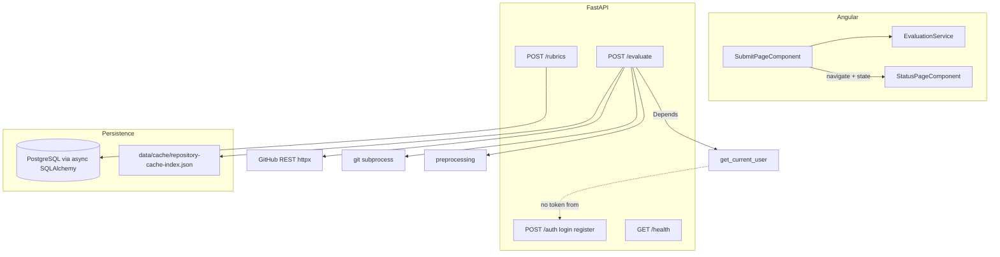

# Milestone 1 forensic audit (verified 2026-04-01)

**Auditor:** Jayden (with Cursor-assisted verification)  
**Committed as:** canonical Milestone 1 audit for the `maple-a1` repository.

## Stale artifact warning

[audits/milestone-01-forensic-audit-jayden-2026-04-01T204311Z.md](milestone-01-forensic-audit-jayden-2026-04-01T204311Z.md) (if present as a local draft) **Section 1.2** may state PostgreSQL schema, `POST /rubrics`, and `services/llm.py` are absent. The current tree **does** include [alembic/versions/010126822022_create_initial_schema.py](../alembic/versions/010126822022_create_initial_schema.py), [server/app/models/](../server/app/models/), [server/app/routers/rubrics.py](../server/app/routers/rubrics.py), and [server/app/services/llm.py](../server/app/services/llm.py). Prefer **this** document for governance.

---

## 1. Feature synthesis and modular architecture

### 1.1 Functional features (evidence-based)

| Feature | Implementation | Primary evidence |
| --- | --- | --- |
| **Repository ingest (`POST /evaluate`)** | Multipart: `github_url`, optional `assignment_id`, `rubric` file; GitHub API validation + default-branch SHA; shallow clone via `GIT_ASKPASS`; preprocess; JSON cache index under `data/cache/`; returns `submission_id`, digests, paths, `cached` / `cloned` | [server/app/main.py](../server/app/main.py) `evaluate_submission` (approx. 435–582), `clone_repository` (162–267), `validate_github_repo_access` (270–330), `resolve_repository_head_commit_hash` (333–383) |
| **Preprocessing** | Strips `.git`, `node_modules`, venv dirs, `__pycache__`, compiled/binary suffixes | [server/app/preprocessing.py](../server/app/preprocessing.py) |
| **Repository cache** | Key `commit_hash::rubric_digest`; SHA-256 path token; eviction if disk path missing; `last_used_at` bump on read | [server/app/cache.py](../server/app/cache.py) |
| **Health** | MAPLE-style envelope via `success_response` | [server/app/main.py](../server/app/main.py) 585–587 |
| **Rubric persistence** | `POST /api/v1/code-eval/rubrics` with Pydantic validation, sum check, SQLAlchemy insert | [server/app/routers/rubrics.py](../server/app/routers/rubrics.py) |
| **DB layer (schema + ORM)** | Alembic initial migration; async SQLAlchemy models for User, Rubric, Assignment, Submission, EvaluationResult | [alembic/versions/010126822022_create_initial_schema.py](../alembic/versions/010126822022_create_initial_schema.py), [server/app/models/database.py](../server/app/models/database.py) |
| **Auth scaffold** | JWT encode/decode (HS256), bcrypt helpers; OAuth2 bearer dependency on `/evaluate`; **login/register return 501** | [server/app/utils/security.py](../server/app/utils/security.py), [server/app/middleware/auth.py](../server/app/middleware/auth.py), [server/app/routers/auth.py](../server/app/routers/auth.py) |
| **Regex redactor (M1)** | `redact` / `redact_dict` for PAT-like tokens, emails, `KEY=value` env lines | [server/app/services/llm.py](../server/app/services/llm.py) 16–52 |
| **Angular submit** | Reactive form; multipart POST; `Authorization: Bearer` from `environment.devToken` | [client/src/pages/submit-page/submit-page.component.ts](../client/src/pages/submit-page/submit-page.component.ts), [client/src/services/evaluation.service.ts](../client/src/services/evaluation.service.ts) |
| **Angular status** | Reads `history.state` only; **no HTTP polling**; route `status/:id` param unused | [client/src/pages/status-page/status-page.component.ts](../client/src/pages/status-page/status-page.component.ts), [client/src/app/app.routes.ts](../client/src/app/app.routes.ts) |

### 1.2 Cross-reference to Milestone 1 tasks

- **Jayden (structure, DO, Nginx, secrets):** Repo layout and [.env.example](../.env.example) are present; cloud/Nginx are procedural ([docs/deployment.md](../docs/deployment.md)) — not fully verifiable from code alone.
- **Dom (schema + migrations):** **Implemented** (Alembic + SQLAlchemy). **Gap:** application **`/evaluate` does not use the database** — no `Submission` row is created; schema is unused for the main user journey.
- **Dom (`POST /rubrics` + A5 validation):** **Partially implemented** — endpoint exists with strict Pydantic models, but there is **no versioned JSON Schema file** or explicit A5 schema pin as called out in design risk §7 ([docs/design-doc.md](../docs/design-doc.md) ~446–449).
- **Dom (regex redactor in `llm.py`):** **Implemented** as library code; **not invoked** from `/evaluate` or any other path (grep shows `redact` only in `llm.py`). Milestone wording (“before any external call”) is **not enforced in the pipeline** yet.
- **Sylvie (PAT clone, preprocessor, cache, Angular):** **Largely implemented**. **Gap:** milestone task asks for a **status polling page**; the UI explicitly defers polling to Milestone 2 in code comments ([client/src/pages/status-page/status-page.component.ts](../client/src/pages/status-page/status-page.component.ts) 19–21).

### 1.3 Dependency map (as implemented)

**Architectural observation:** Ingestion orchestration, Git I/O, and filesystem cache live in [server/app/main.py](../server/app/main.py) rather than a dedicated service layer. PostgreSQL is wired for **rubrics only** today, not submissions — this is **drift from the SRS data model** ([docs/design-doc.md](../docs/design-doc.md) §2 “Persist entities”) for the evaluate flow.

### 1.4 Component interaction vs milestone deliverable

The milestone deliverable is: *student submits URL → clone + preprocess → returns `submission_id`*. That path **works** and returns IDs such as `sub_{uuid4().hex[:12]}` ([server/app/main.py](../server/app/main.py) 510, 568–574). However, those IDs are **ephemeral strings**, not persisted `submissions.id` (UUID) from the schema, so they **cannot** anchor `GET /submissions/{id}` or instructor history without a breaking contract change or mapping layer.

---

## 2. Gap analysis — ambiguities, interface mismatches, predictive errors

**M1 task owner** maps each gap to the person/area named in [docs/milestones/milestone-01-tasks.md](../docs/milestones/milestone-01-tasks.md): **Jayden** (infrastructure, secrets, repo structure), **Dom** (PostgreSQL schema/migrations, `POST /rubrics`, regex redactor in `services/llm.py`, backend API/security), **Sylvie** (PAT-based clone, preprocessor, cache key, Angular submit + status polling). Use **Integration** where the milestone’s integration note applies (wiring Dom’s persistence to Sylvie’s `/evaluate` path, or coordinating API + UI contracts).

| Severity | M1 task owner | Error cause | Error explanation | Origin location(s) |
| --- | --- | --- | --- | --- |
| **High** | Dom; Sylvie (integration) | `POST /evaluate` never persists `Submission` | Database schema and ORM exist, but the evaluate handler only updates the JSON cache index. Downstream milestones assume PostgreSQL as source of truth for submissions and evaluation results ([docs/design-doc.md](../docs/design-doc.md) §2, Milestone 2 bullets). You will need duplicate ID semantics (`sub_…` string vs UUID) or a migration of client contract. **Dom** owns schema/migrations and DB writes; **Sylvie** owns ingestion orchestration in `main.py` per milestone split. | [server/app/main.py](../server/app/main.py) 435–582; [server/app/models/submission.py](../server/app/models/submission.py) |
| **High** | Dom; Sylvie | No `GET /api/v1/code-eval/submissions/{id}` | Design lists this endpoint for polling ([docs/design-doc.md](../docs/design-doc.md) §2 API Design). Milestone 1 task list explicitly asks for a **status polling page** ([docs/milestones/milestone-01-tasks.md](../docs/milestones/milestone-01-tasks.md) Sylvie). Neither backend route nor client polling exists; status page is navigation + `history.state` only. **Dom** implements the read API; **Sylvie** implements polling UI and client service calls. | [server/app/main.py](../server/app/main.py) (no route); [client/src/pages/status-page/status-page.component.ts](../client/src/pages/status-page/status-page.component.ts) 15–22 |
| **High** | Dom | Auth flow is non-functional for real users | `get_current_user` requires a Bearer JWT ([server/app/middleware/auth.py](../server/app/middleware/auth.py) 27–59), but `/auth/login` and `/auth/register` return **501** ([server/app/routers/auth.py](../server/app/routers/auth.py) 16–30). OpenAPI `tokenUrl` points at login ([server/app/middleware/auth.py](../server/app/middleware/auth.py) 27), which cannot issue tokens. Production or fresh clones depend on ad-hoc JWT generation (see client env comment). Auth scaffold sits under **Dom** (“Backend API, Database & Security”); client token handling is **Sylvie** once login exists. | [server/app/routers/auth.py](../server/app/routers/auth.py); [client/src/environments/environment.ts](../client/src/environments/environment.ts) |
| **Medium** | Sylvie; Dom (integration) | API contract drift: JSON vs multipart | SRS example for `POST /evaluate` shows JSON body with `submission_id` in request ([docs/design-doc.md](../docs/design-doc.md) 115–143). Implementation is **multipart form** with file upload and no request `submission_id`. Clients following the doc will fail integration. **Sylvie** owns evaluate request shape; align with **Dom**/SRS or document deviation. | [server/app/main.py](../server/app/main.py) 435–440 |
| **Medium** | Dom | Redactor not wired | `redact` exists but is never called before GitHub or (future) LLM usage. Violates milestone checklist intent and FERPA mitigation narrative (“before external API calls”) once content leaves the server. Milestone assigns the redactor to **Dom** (`services/llm.py`); call sites may span ingestion (**Sylvie**) when payloads are assembled. | [server/app/services/llm.py](../server/app/services/llm.py); [server/app/main.py](../server/app/main.py) (no import/use) |
| **Medium** | Dom; Sylvie (integration) | `assignment_id` type mismatch | Form accepts arbitrary string; DB expects UUID FK to `assignments`. No validation or lookup — future persistence will reject or require unsafe coercion. **Sylvie** (Angular + evaluate form); **Dom** (validation, FK, assignment lifecycle). | [server/app/main.py](../server/app/main.py) 438; [alembic/versions/010126822022_create_initial_schema.py](../alembic/versions/010126822022_create_initial_schema.py) `submissions.assignment_id` |
| **Medium** | Dom; Sylvie (integration) | Rubric shapes inconsistent | Evaluate accepts flexible rubric JSON/text for fingerprinting; `POST /rubrics` expects `criteria[].levels[]` with points — different from SRS evaluate example (`criteria[].name` + `description` only). Risk of two incompatible “rubric” concepts in the product. **Dom** owns `POST /rubrics` and A5-style validation; **Sylvie** owns rubric upload on evaluate. | [docs/design-doc.md](../docs/design-doc.md) 124–135; [server/app/routers/rubrics.py](../server/app/routers/rubrics.py) 21–37 |
| **Medium** | Dom; Sylvie (integration) | Duplicate `RequestValidationError` handlers | Two handlers are registered ([server/app/main.py](../server/app/main.py) 407–416 and 425–432). FastAPI keeps one mapping per exception type — the **later registration wins**, so the first handler is **dead**; responses may omit the richer `error_response` formatting from [server/app/utils/responses.py](../server/app/utils/responses.py) that the first handler used. `main.py` mixes global API wiring with Sylvie’s evaluate flow; treat as shared backend hygiene (**Dom** lead, **Sylvie** co-owner of `main.py` ingestion). | [server/app/main.py](../server/app/main.py) 407–432 |
| **Low** | Dom; Sylvie (integration) | Duplicate / conflicting imports in `main.py` | Top of file mixes `from server.app...` and relative imports and duplicates symbols (`FastAPI`, `Request`, `CORSMiddleware`, `settings`, `success_response`). Hurts maintainability and can mask which `error_response`/`success_response` is canonical. Same ownership split as other `main.py` issues. | [server/app/main.py](../server/app/main.py) 1–38 |
| **Low** | Sylvie | Client URL validation stricter than server | Submit form regex requires `https://github.com/...` only; server allows `www.github.com` via `HttpUrl` + host check ([server/app/main.py](../server/app/main.py) 86–88). Edge-case UX mismatch. | [client/src/pages/submit-page/submit-page.component.ts](../client/src/pages/submit-page/submit-page.component.ts) 17 |
| **Low** | Sylvie | Status deep-link is empty | `status/:id` does not read `ActivatedRoute` or fetch by `id`; opening `/status/sub_xxx` in a new tab shows no data. Falls under **Sylvie** “status polling page” scope once `GET /submissions/{id}` exists. | [client/src/pages/status-page/status-page.component.ts](../client/src/pages/status-page/status-page.component.ts) |
| **Informational** | — (not in M1 task split; M5 docs) | [docs/api-spec.md](../docs/api-spec.md) is a placeholder | Milestone 5 asks for full spec; current gap blocks external integrators. Not assigned in [milestone-01-tasks.md](../docs/milestones/milestone-01-tasks.md); recommend **Jayden** (docs structure) + **Dom** (endpoint accuracy) at handoff. | [docs/api-spec.md](../docs/api-spec.md) |
| **Informational** | Dom (deferred M3) | `complete()` raises `NotImplementedError` | Correctly deferred to Milestone 3 per file docstring ([server/app/services/llm.py](../server/app/services/llm.py) 73–85). | Same |

---

## 3. Remediation roadmap (High / Extreme)

### 3.1 Persist submissions from `/evaluate` (High)

1. After successful clone/cache resolution, **insert** a `Submission` row: `github_repo_url`, `commit_hash`, `status` (`cloned` / `cached` or map to enum), FKs for `assignment_id` and `student_id` (requires defining how student identity is derived from JWT `sub` vs new User rows).
2. Return **database primary key** (UUID) as `submission_id`, or return both `submission_id` (UUID) and a stable external alias — document the contract in OpenAPI and Angular types ([client/src/utils/api.types.ts](../client/src/utils/api.types.ts)).
3. Add integration tests that assert a row exists after evaluate (with DB test fixture or transaction rollback).

**Definition of done:** One successful evaluate creates exactly one `Submission` row queryable by ID; Angular uses that ID in the status URL; no orphaned cache entries without DB rows (or explicit decision to allow cache-only mode).

### 3.2 Implement `GET /submissions/{id}` + polling (High)

1. Add read endpoint returning MAPLE envelope with status + paths + future fields (stub `evaluation_result` as null until Milestone 2).
2. Status page: inject `ActivatedRoute`, if `history.state` missing then **GET by param**, poll with `takeWhile`/`interval` until terminal status (per TODO comment).
3. Align polling interval and backoff with NFR expectations in later milestones.

**Definition of done:** Refreshing `/status/{id}` works; submit flow and direct URL behave the same.

### 3.3 Repair auth scaffold (High)

1. Implement `register` / `login` against `User` model (hash passwords, issue JWT with `sub` + `role`).
2. Remove or narrow **501** responses; ensure `tokenUrl` in OpenAPI matches a working token endpoint.
3. Replace committed **dev JWT** in Angular with local-only override (e.g. `environment.development.ts` gitignored) or document generator script only.

**Definition of done:** New developer can obtain a token via API without editing source; no long-lived secrets in tracked client files for production builds.

---

## 4. Security and vulnerability assessment

| Area | Finding | Notes |
| --- | --- | --- |
| **Authentication** | Broken login + JWT-only protected evaluate | Forces shared/dev tokens; increases secret leakage risk ([client/src/environments/environment.ts](../client/src/environments/environment.ts)). |
| **Secrets in repo** | Example PAT pattern in [.env.example](../.env.example) (`GITHUB_PAT=ghp_...`) | Triggers scanners; acceptable if clearly fake — prefer `ghp_REPLACE_ME` without valid prefix shape. |
| **Injection** | Rubric endpoint uses SQLAlchemy ORM | Parameterized; low SQLi risk for current code paths. |
| **SSRF / arbitrary clone** | `github_url` restricted to `github.com` / `www.github.com` | Limits abuse; good baseline ([server/app/main.py](../server/app/main.py) 86–88). |
| **Path / clone safety** | `sanitize_clone_path_segment` | Reduces path injection in on-disk layout ([server/app/main.py](../server/app/main.py) 55–60). |
| **PAT leakage** | Clone stderr scrubs PAT substring | Good practice ([server/app/main.py](../server/app/main.py) 224–226). |
| **CORS** | `allow_credentials=True` with configured origins | Avoid wildcard origins in production ([server/app/main.py](../server/app/main.py) 395–401). |
| **Logic / authorization** | No per-submission ownership check possible yet | Without persisted submissions and user FK, future authorization must be designed when GET exists. |

---

## 5. Efficiency and optimization (low-risk first)

- **GitHub API:** `validate_github_repo_access` and `resolve_repository_head_commit_hash` run **sequentially** ([server/app/main.py](../server/app/main.py) 491–497). **Low-risk win:** parallelize with `asyncio.gather` **only if** error semantics remain identical (401/403 handling). **Risk:** slightly more complex failure aggregation.
- **Cache index I/O:** `load_repository_cache_entry` rewrites the index on every cache hit to update `last_used_at` ([server/app/cache.py](../server/app/cache.py) 92–94). **Low-risk:** batch or debounce writes if the index grows large; **risk:** durability window if process crashes before flush — document tradeoff before changing.
- **`redact_dict`:** Uses `deepcopy` ([server/app/services/llm.py](../server/app/services/llm.py) 33–36) — fine for small payloads; for full-repo metadata in later milestones, prefer streaming or selective redaction to avoid memory spikes (**higher risk** if applied naïvely to huge structures).

---

## 6. Document history

This file is the **committed** Milestone 1 forensic audit, verified against the repository and aligned with [docs/milestones/milestone-01-tasks.md](../docs/milestones/milestone-01-tasks.md) for **M1 task owner** assignments in the gap table (Jayden / Dom / Sylvie / integration). It corrects earlier draft language that claimed Alembic, `POST /rubrics`, and `server/app/services/llm.py` were missing. Implementation work for listed remediations is out of scope for this documentation-only commit.
