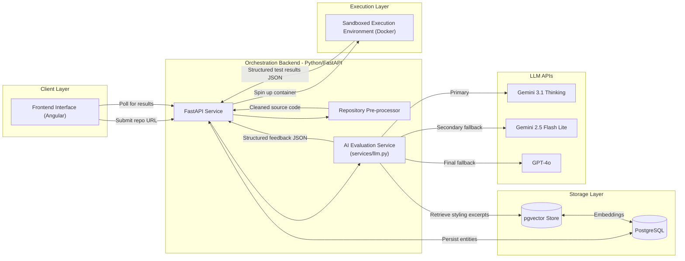

# Maple A1
## System Requirements Specifications

## 1. Problem Statement and User Stories
*(Sylvie)*

---

## 2. System Architecture

The Code Submission Evaluator (A1) employs a modern, highly decoupled client-server architecture designed to balance the strict security requirements of executing untrusted student code with the probabilistic nature of Large Language Model (LLM) evaluations. The system is built to ingest entire GitHub repositories, process them efficiently to preserve LLM context windows, and deliver comprehensive, pedagogically sound feedback based on standardized rubrics.

### Architecture Diagram

The following diagram represents the core components of the A1 system and their interactions:

Pretty version found at location: `/pretty-architecture-overview-diagram.jpg`

### Component Descriptions

- **Frontend Interface (Angular):** The user-facing application serves as the primary dashboard for both faculty and students. Faculty use it to configure assignments and import standardized JSON rubrics (compatible with the A5 Rubric Engine). Students and graders use it to submit GitHub repository links. The Angular client polls the backend for asynchronous grading updates and renders the final structured JSON feedback into an intuitive, human-readable format.

- **Orchestration Backend (Python/FastAPI):** Acting as the central nervous system, this monolithic Python service exposes RESTful API endpoints, manages database transactions, and coordinates the entire grading lifecycle. FastAPI was chosen for its native asynchronous capabilities, which are essential when managing long-running tasks like cloning repositories, running tests, and awaiting LLM generations.

- **Repository Pre-processor:** A critical backend utility designed to handle the complexity and scale of full GitHub repositories. It clones the provided link and aggressively strips out unnecessary files (e.g., `node_modules`, `venv`, compiled binaries, and hidden `.git` folders). This ensures that only relevant source code is analyzed, minimizing token costs and preventing the LLM's context window from being overwhelmed by bloat.

- **Sandboxed Execution Environment (Docker Engine):** This component directly addresses the core security challenge of running untrusted student code. Instead of executing code on the host machine, the FastAPI backend interacts with the Docker daemon to spin up ephemeral, highly restricted containers. It mounts the cleaned student repository alongside the instructor's test suite, executes the deterministic tests, captures the output as structured JSON, and immediately destroys the container.

- **AI Evaluation Service (LLM Wrapper):** Adhering strictly to MAPLE AI Integration Conventions, all LLM interactions route through a centralized wrapper (`services/llm.py`). This service handles retries with exponential backoff, timeouts, and structured logging of token usage and latency. It utilizes a multi-pass strategy: Pass 1 analyzes the deterministic test results against the A5 rubric; Pass 2 reads targeted source files to assess style, complexity, and best practices; Pass 3 synthesizes this data into final, structured pedagogical feedback mapped precisely to the rubric criteria.

- **Relational Database (PostgreSQL):** A robust SQL database used to persist all system entities, ensuring data integrity across assignments, rubrics, submissions, and historical evaluation metrics.

### API Design

The backend exposes several key RESTful endpoints to facilitate the module's primary functionalities:

#### `POST /api/v1/submissions`

- **Purpose:** Triggers the asynchronous grading pipeline for a student's code.
- **Request Format:** JSON containing `assignment_id` and `github_repo_url`.
- **Response Format:** JSON returning a generated `submission_id` and `status: "processing"`.

#### `GET /api/v1/submissions/{id}/evaluation`

- **Purpose:** Polled by the Angular frontend to retrieve the final graded feedback and test results once the asynchronous processing is complete.
- **Request Format:** URL Path Parameter (`id`).
- **Response Format:** JSON containing the test execution results and the structured AI feedback, strictly adhering to the MAPLE criteria scores and flags schema.

#### `POST /api/v1/rubrics`

- **Purpose:** Allows faculty or the A5 Rubric Engine module to load grading criteria into the system.
- **Request Format:** JSON matching the standardized A5 schema (`rubric_id`, `criteria`, `levels`).
- **Response Format:** JSON confirming successful ingestion and validation.

### Data Model

The PostgreSQL database persists the following core entities and relationships:

- **Assignment:** Represents a specific homework task. Contains `id`, `title`, `instructor_id`, `test_suite_repo_url` (pointing to the secure instructor test code), and a foreign key linking to a `rubric_id`.

- **Rubric:** Stores the grading criteria. Contains `id`, `assignment_id`, and `schema_json`. The `schema_json` field stores the exact JSON structure required by the MAPLE standard, ensuring seamless interoperability with the A5 module.

- **Submission:** Represents a student's individual attempt. Contains `id`, `assignment_id`, `student_id`, `github_repo_url`, `commit_hash` (to lock the exact version being graded and prevent mid-grading mutations), and a `status` enum (`Pending`, `Testing`, `Evaluating`, `Completed`, `Failed`).

- **EvaluationResult:** The final output entity linked to a submission. Contains `id`, `submission_id`, `deterministic_score` (calculated purely from the sandboxed test suite), `ai_feedback_json` (the exact criteria breakdown, flags, and overall feedback), and `metadata_json` (which records latency, passes, and model used, fulfilling the logging and observability requirements).

- **Relationships:** An Assignment has one Rubric and many Submissions. Each Submission has one corresponding EvaluationResult.

---

## 3. Data Pipeline Design

### Overview & Design Philosophy

The A1 Code Evaluation pipeline is engineered as a **Deterministic-Probabilistic Hybrid**, designed to balance the objective rigidity of unit tests with the nuanced feedback of Large Language Models. The core architecture centers on **AST-Aware processing**, which treats source code not as flat text, but as a structured tree. This allows the system to maintain logical integrity during chunking and context optimization. To ensure high reliability (NFR-2.1) within a strict $50/month budget, the pipeline prioritizes **SHA-based caching** to eliminate redundant LLM calls and a **multi-tiered fallback strategy** (Gemini 3.1 Flash → Gemini 2.5 → GPT-4o) for resilient feedback synthesis.

### I. Data Acquisition & Secure Ingestion

The tool utilizes a multi-source input vector to generate assessments. The primary ingestion payload includes a GitHub URL, an assignment rubric (JSON conforming to the A5 Rubric Engine schema), test case suites, and an options object containing student-provided environment variables.

To prevent data leakage, the pipeline implements a **Volatile Injection** strategy. Personal Access Tokens (PATs) clone private repositories into `data/raw/`, while sensitive environment variables are decrypted in-memory by the FastAPI backend and injected directly into the Docker Sandbox via the Docker SDK. These variables are never written to disk and are scrubbed from logs via a **Regex Redactor** in the LLM API Call Wrapper to satisfy NFR 2.1. A pre-flight check ensures language-specific configuration files (e.g., `package.json`) exist; if missing, the system triggers a `400 VALIDATION_ERROR` to save tokens.

### II. Ingestion Processing & Context Optimization

To optimize performance, the system implements a **SHA-Based Caching** layer, hashing the GitHub Commit SHA with the Rubric ID. A re-evaluation is only triggered if the codebase or rubric version changes.

The **Context Optimizer** utilizes an AST parser to implement an **AST-Aware Chunking** strategy. Unlike fixed-size splitting, this strategy extracts terminal nodes (functions, classes, or methods) as discrete logical units. If a node exceeds the token limit, it is recursively split into internal branches; if multiple nodes are undersized, they are merged to maintain density. This ensures the LLM receives complete, unbroken logical contexts. During the **Static Analysis** phase, linters (`pylint`/`eslint`) identify convention violations which act as triggers to query the pgvector store, retrieving only styling excerpts relevant to the student's specific errors.

### III. Probabilistic Synthesis & Feedback Generation

The synthesis layer unifies the cleaned source code, the Docker-generated test report, the rubric, and RAG-sourced styling snippets into a single reasoning object. This is fed to Gemini 3.1 with a system prompt defining the AI's role as a mentor. The LLM reconciles deterministic test results with the codebase to determine if failures are logical bugs or environment-related. For every criterion below "Exemplary," the AI generates a **Recommendation Object** providing a Git-style diff localized by file path and line number. The final output is wrapped in the **MAPLE Standard Response Envelope**, including latency and evaluation metadata.

### IV. Data Freshness & Quality Monitoring

Data freshness is guaranteed by the SHA-Rubric coupling. To maintain reliability, the pipeline implements a **Sandbox Observability Layer** to handle execution-level quality issues:

- **Resource Constraints:** The Docker SDK implements a 30-second TTL. If a container is killed via `137` (OOM) or `124` (Timeout), the system injects a **Resource Constraint Metadata** flag into the reasoning object, forcing the LLM to identify infinite loops or memory leaks rather than guessing at logic.

- **Log Normalization:** To prevent context bloat from infinite print statements, a **Circular Buffer** truncates logs, retaining only the first 2KB and last 5KB of the execution trace.

- **Hierarchical Fallback Strategy:**
  - **Primary:** Gemini 3.1 Thinking.
  - **Secondary:** Gemini 2.5 Flash Lite (if primary latency exceeds 60s).
  - **Final Fallback:** GPT-4o (for complex reconciliation failures).

All interactions are logged in structured JSON, with all PII and secrets scrubbed via the redaction layer.

---

## 4. AI Integration Specification
*(Jayden)*

---

## 5. Evaluation Plan
*(Sylvie)*

---

## 6. Deployment and Infrastructure Plan
*(Dom)*

---

## 7. Risk Assessment and Mitigation
*(Dom)*

---

## 8. Timeline and Milestones
*(All)*

> **Note:** I think we should have the milestones required + get a basic outline from an LLM for the checklist deliverables of each milestone.
