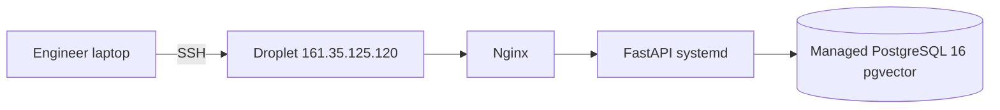

# MAPLE A1 — Deployment and onboarding

This guide is for **engineers** who need access to production, deployment steps, and a production-like local setup. For product goals, API shape, and system architecture, read [`docs/design-doc.md`](design-doc.md) first; this document focuses on **operations** and **environments**.

**Suggested read order:** Work through the sections below from top to bottom on your first pass. Use [Quick reference](#quick-reference) afterward for lookups.

> **Requires Jayden (server administrator):** Many steps need Jayden (or another designated admin) for DigitalOcean, SSH keys, secrets, or database allowlists. For every situation, what to do and what *not* to do is summarized in [When to contact Jayden](#when-to-contact-jayden). Jayden-specific procedures are in [Jayden: granting access](#jayden-granting-access-digitalocean-droplet-database).

---

## Purpose and audience

| Audience | Use this doc for |
|----------|------------------|
| **New engineers** | Access, SSH, `.env`, database connectivity, deploy steps, local “production-like” setup |
| **Jayden** | Granting DigitalOcean, Droplet, and database access; assisting with secrets and allowlists |

---

## Production architecture at a glance

**As deployed today** (from this document’s operational baseline):

| Component | Details |
|-----------|---------|
| **Server** | Ubuntu **LTS** Droplet (`161.35.125.120`) on DigitalOcean — **4 GB RAM / 2 vCPU** (matches [`docs/design-doc.md`](design-doc.md) §6 sizing; pilot image **24.04** as deployed) |
| **Database** | DigitalOcean Managed PostgreSQL 16 with **pgvector** enabled for RAG-style storage |
| **Reverse proxy** | Nginx at **`https://api.maple-a1.com`** (Let’s Encrypt, Certbot). Structure: [Nginx production structure](#nginx-production-structure-apimaple-a1com). |
| **Process manager** | systemd (`maple-a1.service`) |
| **Application** | FastAPI (Uvicorn), repo on Droplet at `/opt/maple-a1`, runtime user **`maple`**; SSH as **`root`**, then `su - maple` for app work |



### Design vs current deployment

The [deployment and infrastructure plan in `docs/design-doc.md`](design-doc.md) (Section 6) and [Milestone 1](design-doc.md) describe additional **targets** and roadmap items. Where they differ from this file, prefer **this document** for day-to-day operations until both are aligned.

| Topic | Target / design (`docs/design-doc.md`) | Production today (this document) |
|-------|------------------------------------------|----------------------------------|
| **Droplet sizing** | 4 GB RAM / 2 vCPU | **Matches** — 4 GB RAM / 2 vCPU |
| **Docker** | Docker on the Droplet; backend uses `/var/run/docker.sock` for sandboxed execution | Not described in detail in this file; confirm on the Droplet if you need the sandbox |
| **Frontend (Angular)** | Section 6 mentions DigitalOcean App Platform for static frontend hosting | **App Platform is not used for Angular** in this project; hosting for the Angular app is separate from App Platform (see team for URL and hosting details). Consider updating §6 in `docs/design-doc.md` to match. |
| **CI/CD** | GitHub Actions on pushes to `dev`; manual deploy for pilot | Production deploy uses `git pull origin main` on the Droplet |
| **Domain & TLS** | Domain **maple-a1.com**, API host **api.maple-a1.com**, Certbot, Nginx TLS | **Matches** design §6: NS → DigitalOcean DNS, **`A` `api` → Droplet**, HTTPS for `api.maple-a1.com` with Certbot; see [Nginx production structure](#nginx-production-structure-apimaple-a1com). |
| **Database** | Managed PostgreSQL with **pgvector** for RAG | **Managed PostgreSQL 16 with pgvector configured** |

If you find a conflict between this file and the live server, treat the **live system** as truth and ask Jayden to update this document.

### Known gaps

- **Alembic** migrations are **planned for later in development** (see [Deploy procedure](#deploy-procedure)); the deploy script still lists `alembic upgrade head` for when that work lands.

### Nginx reference config (versioned in git)

A **sanitized** example site config (upstream, `proxy_pass`, forwarding headers) lives at [`docs/nginx/maple-a1.example.conf`](nginx/maple-a1.example.conf). It is not the live Droplet file; copy and adapt on the server, then run `nginx -t` before reload.

### Nginx production structure (`api.maple-a1.com`)

This summarizes the **live** reverse proxy as implemented for [`docs/milestones/milestone-01-tasks.md`](milestones/milestone-01-tasks.md) (Jayden: Nginx + Let’s Encrypt) and [`docs/design-doc.md`](design-doc.md) §6 (Nginx terminates TLS; FastAPI does not).

| Item | Detail |
|------|--------|
| **Conffile** | `/etc/nginx/sites-enabled/maple-a1` (symlink from `sites-available`). **Root-owned** — edit with `sudo` (e.g. `sudo nano …`). |
| **`server_name`** | `api.maple-a1.com` — required so Certbot (`certbot --nginx` or `certbot install --cert-name api.maple-a1.com`) can attach certificates. A catch-all `server_name _` alone does **not** match; the installer will fail until this is set. |
| **TLS** | `listen 443 ssl;` with `ssl_certificate` / `ssl_certificate_key` under `/etc/letsencrypt/live/api.maple-a1.com/`, plus includes supplied by Certbot (`options-ssl-nginx.conf`, `ssl-dhparams.pem`). |
| **HTTP → HTTPS** | Separate `server` on port **80**: redirect to HTTPS for `api.maple-a1.com` (Certbot-managed pattern). |
| **Upstream** | `location /api/` → `proxy_pass http://127.0.0.1:8000;` with `proxy_set_header` for `Host`, `X-Real-IP`, `X-Forwarded-For`, `X-Forwarded-Proto`. Only paths under **`/api/`** reach FastAPI (e.g. health: `/api/v1/code-eval/health`). |
| **Body size** | `client_max_body_size 50M;` for multipart evaluate uploads. |
| **Firewalls** | **DigitalOcean Cloud Firewall:** inbound **TCP 80**, **443** (and **22** for SSH), per Milestone 1 “secured server environment.” **Droplet `ufw`:** if **active**, must include **`ufw allow 443/tcp`** (and **80/tcp**); otherwise external **`curl https://…`** can time out while `ss` still shows nginx listening on `0.0.0.0:443`. |
| **Packages** | `certbot`, `python3-certbot-nginx` via `apt` on Ubuntu LTS; renewal uses the **`certbot.timer`** systemd unit when installed by the package. |

### Runbook: api.maple-a1.com (Jayden)

**Goal:** Let’s Encrypt TLS on Nginx for **`api.maple-a1.com`**, proxying to Uvicorn on the Droplet (see [`docs/design-doc.md`](design-doc.md) §6).

1. **DNS (registrar)** — Create **`A`** record: host **`api`** → **Droplet public IPv4** (verify in DigitalOcean; this guide has used `161.35.125.120`—confirm before relying on it). Wait for propagation; check: `dig +short api.maple-a1.com`.
2. **Firewall** — Inbound **TCP 80** and **443** on the **DigitalOcean Cloud Firewall** (and **22** for SSH). If **`ufw`** is **enabled** on the Droplet, run **`sudo ufw allow 80/tcp`**, **`sudo ufw allow 443/tcp`**, then **`sudo ufw reload`** so traffic reaches Nginx.
3. **SSH** — `ssh -i ~/.ssh/your-key root@<droplet-ip>` (then `sudo` as needed), per [SSH and server users](#ssh-and-server-users).
4. **Nginx** — Add or edit a `server` block for **`api.maple-a1.com`** on **port 80** with `location /api/` → `proxy_pass http://127.0.0.1:<APP_PORT>` (match **`APP_PORT`** in `/opt/maple-a1/.env` and `maple-a1.service`) and the proxy headers in [Nginx production structure](#nginx-production-structure-apimaple-a1com). Run `sudo nginx -t && sudo systemctl reload nginx`.
5. **Certbot** — `sudo certbot --nginx -d api.maple-a1.com` (install `certbot` / `python3-certbot-nginx` if missing). Run `sudo certbot renew --dry-run` to confirm renewal.
6. **Verify** — From a laptop: `curl -sS -o /dev/null -w "%{http_code}\n" "https://api.maple-a1.com/api/v1/code-eval/health"` → expect **200** (use **GET**, not HEAD).
7. **Repo / checklist** — Update [Production architecture at a glance](#production-architecture-at-a-glance) and [Design vs current deployment](#design-vs-current-deployment) to state **HTTPS live**, remove or narrow the DNS gap bullet above, and mark the Jayden TLS line **`[x]`** in [`docs/milestones/milestone-01-tasks.md`](milestones/milestone-01-tasks.md).
8. **CORS / Angular** — On the Droplet, set **`CORS_ORIGINS`** in `/opt/maple-a1/.env` to the **exact HTTPS origin** of the deployed Angular app (the **browser’s** origin, not the API hostname). Production build uses **`apiBaseUrl: 'https://api.maple-a1.com'`** in [`client/src/environments/environment.prod.ts`](../client/src/environments/environment.prod.ts) so the SPA calls the API over HTTPS.

---

## Nginx and TLS (Certbot)

This section is for **Jayden** (or the server administrator) to move from an **IP-only** HTTP front door to a **hostname + HTTPS** setup aligned with [`docs/design-doc.md`](design-doc.md) §6 (Nginx reverse proxy, Let’s Encrypt).

### Prerequisites

1. A **DNS hostname** (A or AAAA) pointing at the Droplet’s public IP (or at a load balancer in front of it, if you add one later).
2. **Firewall / DigitalOcean Cloud Firewall:** allow **80** and **443** from the Internet for HTTP-01 validation and HTTPS clients; keep **22** for SSH per your security policy.
3. Know the **Uvicorn listen port** the app uses in production (from `/opt/maple-a1/.env` as `APP_PORT`, and consistent with `maple-a1.service`).

### Install packages (Ubuntu LTS on the Droplet)

```bash
sudo apt update
sudo apt install -y nginx certbot python3-certbot-nginx
```

### Baseline: align Nginx with the repo example

1. Compare the live site config under `/etc/nginx/sites-available/` with [`docs/nginx/maple-a1.example.conf`](nginx/maple-a1.example.conf).
2. Ensure `proxy_set_header` directives include at least: `Host`, `X-Real-IP`, `X-Forwarded-For`, `X-Forwarded-Proto` (so FastAPI sees HTTPS and client IP correctly).
3. Test and reload:

   ```bash
   sudo nginx -t && sudo systemctl reload nginx
   ```

### Issue a Let’s Encrypt certificate (HTTP-01)

Run on the Droplet (production API host **`api.maple-a1.com`**):

```bash
sudo certbot --nginx -d api.maple-a1.com
```

Follow the interactive prompts. Certbot will adjust the Nginx server block to use the new certificate paths under `/etc/letsencrypt/live/`.

If HTTP-01 fails (e.g. port 80 blocked), use Certbot’s **DNS** plugin for your DNS provider instead of `--nginx`, then configure `ssl_certificate` / `ssl_certificate_key` manually and run `nginx -t`.

### Certificate saved but “Could not install certificate” / no HTTPS on 443

**Symptom:** Let’s Encrypt reports **Successfully received certificate**, then **Could not install certificate** — *“Could not automatically find a matching server block for api.maple-a1.com. Set the `server_name` directive…”* — and `curl https://api.maple-a1.com` times out.

**Cause:** Nginx only had a **default** `server` (e.g. `server_name _` on port 80). Certbot’s installer needs a **`server_name`** that **exactly matches** the hostname you requested (`api.maple-a1.com`).

**Fix (on the Droplet):**

1. Edit the active site under `/etc/nginx/sites-available/` (often `default` or `maple-a1`).
2. Add a **dedicated** port-80 server block (adjust `8000` to match `APP_PORT` / `maple-a1.service`). Use **`location /api/`** to match the production vhost:

   ```nginx
   server {
       listen 80;
       listen [::]:80;
       server_name api.maple-a1.com;

       client_max_body_size 50M;

       location /api/ {
           proxy_pass http://127.0.0.1:8000;
           proxy_set_header Host $host;
           proxy_set_header X-Real-IP $remote_addr;
           proxy_set_header X-Forwarded-For $proxy_add_x_forwarded_for;
           proxy_set_header X-Forwarded-Proto $scheme;
       }
   }
   ```

3. `sudo nginx -t && sudo systemctl reload nginx`
4. Install the **existing** cert into that vhost:

   ```bash
   sudo certbot install --cert-name api.maple-a1.com
   ```

   (If prompted, choose the `api.maple-a1.com` server block.) Alternatively run `sudo certbot --nginx -d api.maple-a1.com` again — it may reuse the cert and complete install now that `server_name` matches.

5. Confirm Nginx listens on 443: `sudo ss -tlnp | grep ':443'`
6. From your laptop: `curl -sS -o /dev/null -w "%{http_code}\n" "https://api.maple-a1.com/api/v1/code-eval/health"` → **200**.

**Note:** If you still use a **catch-all** `default_server` on port 80, ensure requests with `Host: api.maple-a1.com` hit the new block (name-based vhost order is usually sufficient when `server_name` is explicit).

### After TLS is enabled

1. **Update this document:** change “Nginx (IP-only)” in [Production architecture at a glance](#production-architecture-at-a-glance) to the production hostname and **HTTPS**.
2. **Milestone checklist:** mark the TLS line complete in [`docs/milestones/milestone-01-tasks.md`](milestones/milestone-01-tasks.md) (Jayden section).
3. **Coordinate with app owners:** set `CORS_ORIGINS` in production `.env` to the **HTTPS** origin of the deployed Angular app (FastAPI), and update the frontend’s production API base URL if it still points at raw IP/HTTP.

### Verification (run from your laptop)

Replace hostnames if you use something other than **`api.maple-a1.com`**.

```bash
# DNS
dig +short api.maple-a1.com

# TLS + API health (after Certbot) — use GET; this endpoint may return 405 on HEAD
curl -sS -o /dev/null -w "HTTPS health HTTP %{http_code}\n" "https://api.maple-a1.com/api/v1/code-eval/health"

# HTTP → HTTPS redirect (expected after Certbot configures redirect)
curl -sSI "http://api.maple-a1.com/api/v1/code-eval/health"

# IP-only baseline (before TLS) — documented Droplet in this guide
curl -sS -o /dev/null -w "IP health HTTP %{http_code}\n" "http://161.35.125.120/api/v1/code-eval/health"
```

**On the Droplet** (after editing Nginx): `sudo nginx -t` then `sudo systemctl reload nginx`. Check app logs with `journalctl -u maple-a1 -n 50` (as `root`).

**Maintainer spot-check:** `GET` on **`/api/v1/code-eval/health`** returns **200** over **HTTPS** at `api.maple-a1.com` when DNS, Cloud Firewall, **`ufw`**, Nginx, and Certbot are aligned; **`HEAD`** may return **405** for that route (use **GET** for checks).

### Risks and rollback

- Always run **`sudo nginx -t`** before **`systemctl reload nginx`**. Keep a backup of the previous site file (`cp ... ...bak`).
- If the site breaks after Certbot, restore the backup config, reload Nginx, and revoke or delete the certificate only if you are abandoning that hostname (`certbot delete` — use with care).

---

## Docker socket access (`/var/run/docker.sock`)

The FastAPI backend uses the Docker SDK to spin up ephemeral sandbox containers. To do this it needs access to the Docker daemon socket on the Droplet. The `maple` user (which runs `maple-a1.service`) must be a member of the `docker` group on the host. *(Source: `docs/design-doc.md` §6 "The FastAPI backend will have direct access to the Docker Daemon via the native UNIX socket `/var/run/docker.sock`")*

### Verify Docker is installed (as `root`)

SSH into the Droplet and confirm the Docker daemon is present and running:

```bash
docker version          # prints client + server version if daemon is up
docker info             # prints system-wide info including storage driver
systemctl is-active docker  # should print "active"
```

If `docker` is not found, install it:

```bash
sudo apt update
sudo apt install -y docker.io
sudo systemctl enable --now docker
```

### Check socket permissions

The socket must be group-readable by the `docker` group:

```bash
ls -la /var/run/docker.sock
# Expected: srw-rw---- 1 root docker ... /var/run/docker.sock
```

### Check `maple` user group membership

```bash
groups maple
# Expected output includes "docker"
```

### Grant `maple` access to the socket

If `docker` is not in the output above, add the user to the group:

```bash
sudo usermod -aG docker maple
```

Then restart the service so the process picks up the new group membership (a re-login alone is not sufficient for a running systemd service):

```bash
systemctl restart maple-a1
```

### Verify the fix

Test that the `maple` user can communicate with the daemon directly:

```bash
sudo -u maple docker run --rm hello-world
```

Expected output ends with: `Hello from Docker!`. Any `permission denied` error on `/var/run/docker.sock` means the group assignment did not take effect — confirm with `groups maple` and restart the service again.

> **Security note:** Membership in the `docker` group is effectively root-equivalent on the host because Docker containers can mount the host filesystem. This is acceptable for the `maple` application user under the MAPLE threat model (see `docs/design-doc.md` §7 "Risk 2: Docker Sandbox Misconfiguration"), but **do not** add interactive developer accounts or CI runners to the `docker` group on the production Droplet without explicit approval.

### Verification checklist

| Check | Command | Expected result |
|-------|---------|-----------------|
| Docker daemon running | `systemctl is-active docker` | `active` |
| Socket group | `ls -la /var/run/docker.sock` | group `docker`, mode `srw-rw----` |
| `maple` in docker group | `groups maple` | output includes `docker` |
| End-to-end container test | `sudo -u maple docker run --rm hello-world` | `Hello from Docker!` |

---

## Access and accounts

You need access to the DigitalOcean dashboard to see the Droplet, managed database, firewalls, and related resources.

1. Create a [DigitalOcean](https://www.digitalocean.com/) account if you do not have one. Use whatever email the team agrees on.
2. Send your account email to **Jayden** and ask to be added to the MAPLE A1 team.

See [When to contact Jayden](#when-to-contact-jayden) for what Jayden does on the DigitalOcean side.

---

## SSH and server users

You use **SSH** to reach the Droplet for deploys, logs, and debugging. Every developer uses **their own** keypair — private keys are never shared.

### Your steps

1. Generate a keypair on your machine:

   ```bash
   ssh-keygen -t ed25519 -C "your.name@school.edu" -f ~/.ssh/maple-a1-team
   ```

2. Send **only your public key** (the `.pub` file) to **Jayden**:

   ```bash
   cat ~/.ssh/maple-a1-team.pub
   ```

   Never send your private key. Never paste keys in GitHub issues or public channels.

3. After Jayden confirms your key is installed, test the connection (use **your** key path and filename from step 1):

   ```bash
   ssh -i ~/.ssh/maple-a1-team root@161.35.125.120
   ```

### `root` vs `maple`

- **`root`:** Used for SSH login and for commands such as `systemctl restart maple-a1`.
- **`maple`:** Owns the app directory, Git checkout, virtualenv, and day-to-day deploy commands. After SSH as `root`, run `su - maple` before `git pull`, `pip install`, or editing app files under `/opt/maple-a1`.

See [Jayden: granting access](#jayden-granting-access-digitalocean-droplet-database) for how public keys are installed on the server.

---

## Environment variables

The app is configured with a **`.env`** file. Values must **never** be committed.

### Local development

1. From the repository root:

   ```bash
   cp .env.example .env
   ```

2. Fill in local values. Variable names and example shapes match [`.env.example`](../.env.example) in the repo.

| Variable group | What it configures |
|----------------|-------------------|
| `DATABASE_*` / `DATABASE_URL` | PostgreSQL (use a **local** database for development) |
| `APP_ENV`, `APP_HOST`, `APP_PORT` | Application environment and server binding |
| `SECRET_KEY`, `ALGORITHM`, `ACCESS_TOKEN_EXPIRE_MINUTES` | JWT signing and token lifetime |
| `GITHUB_PAT` | GitHub Personal Access Token — minimum scope: **`repo`** (private read). Used for both student-repo cloning and instructor test-suite cloning. Recommended owner: a service account or instructor account with access to private test-suite repos. If the PAT lacks sufficient scope, test-suite clones fail safely (submission → `Failed`, no credential leakage). |
| `GEMINI_API_KEY`, `OPENAI_API_KEY` | LLM provider keys (placeholders until Milestone 3) |
| `CORS_ORIGINS` | Allowed CORS origins for the frontend |

For credentials you cannot create yourself, see [When to contact Jayden](#when-to-contact-jayden).

### Production

The production `.env` lives on the Droplet at **`/opt/maple-a1/.env`**. The `maple-a1.service` systemd unit loads it when starting Uvicorn. You should not edit it unless you are rotating a secret or adding a variable agreed with the team.

---

## Database connectivity

Your **local** setup normally uses a **local** PostgreSQL instance (see [Local development and mimicking production](#local-development-and-mimicking-production)). This section covers **production** Managed PostgreSQL.

### From your laptop (production database)

If you need to reach **production** from your own machine (debugging, ad hoc queries):

| Approach | Notes |
|----------|--------|
| **SSH tunnel through the Droplet** (preferred) | Route `psql` (or a GUI) through the server; details depend on your tools — coordinate with Jayden so routing and ports match the cluster’s rules. |
| **Temporary trusted IP** | Your public IP is added to the database **trusted sources** in DigitalOcean for a limited time. |

Contact Jayden (see [When to contact Jayden](#when-to-contact-jayden)) with what you need and how long. Do not share database passwords in Slack or tickets.

### From the Droplet (as `maple`)

The Managed PostgreSQL cluster must list the Droplet’s IP in **trusted sources** (DigitalOcean). From a shell as **`maple`**, using values from `/opt/maple-a1/.env` (`DATABASE_HOST`, `DATABASE_PORT`, `DATABASE_USER`, `DATABASE_PASSWORD`, `DATABASE_NAME`):

```bash
cd /opt/maple-a1
# Use less .env first to copy connection details, or export vars you need in this session.
export PGSSLMODE=require
PGPASSWORD='your-database-password-from-env' psql -h YOUR_DATABASE_HOST -p YOUR_DATABASE_PORT -U YOUR_DATABASE_USER -d YOUR_DATABASE_NAME
```

Run `SELECT 1;` as a quick check, then `\q` to exit.

**`DATABASE_URL` vs `psql`:** The app may use `postgresql+asyncpg://` in `DATABASE_URL` for SQLAlchemy. **`psql` uses the normal PostgreSQL protocol** — ignore the `+asyncpg` segment and use host, port, user, password, and database name from `.env` as in the example above.

If `psql` is missing on the Droplet:

```bash
sudo apt update && sudo apt install -y postgresql-client
```

Run that as a user allowed to use `sudo`, or ask Jayden.

---

## Deploy procedure

After your change is merged to **`main`**, deploy with the following sequence (commands are **exactly** as used today):

```bash
# 1. SSH into the Droplet (use YOUR key path)
ssh -i ~/.ssh/maple-a1-team root@161.35.125.120

# 2. Switch to the maple user
su - maple

# 3. Pull latest code
cd /opt/maple-a1
git pull origin main

# 4. Install any new dependencies
source venv/bin/activate
pip install -r server/requirements.txt

# 5. Run database migrations (skip until Alembic is configured — see below)
alembic upgrade head

# 6. Exit back to root and restart the service
exit
systemctl restart maple-a1
```

### Database migrations (Alembic) — later in development

**Alembic configuration and migration files are planned for later in development** — they are not part of the repo workflow yet. Milestone 1 in [`docs/design-doc.md`](design-doc.md) still expects schema managed with SQLAlchemy migrations when that work is done.

Until Alembic is wired up (`alembic.ini`, `versions/`, etc. under `server/` or as the team agrees):

1. **Skip step 5** (`alembic upgrade head`) on deploy; the line stays in the block above so you do not have to relearn the sequence when migrations land.
2. When Alembic is added, run **`alembic upgrade head`** in production after each deploy that includes new revisions, and use the **same migration chain** locally (see [Duplicating production database schema locally](#duplicating-production-database-schema-locally)).

---

## Maple user: app directory and operations

Use the **`maple`** account for code, Git, and the virtualenv. Application files and secrets live under **`/opt/maple-a1`**.

- You **cannot** use or `cd` into **`/root`** as `maple`. If your shell lands there, run `cd /opt/maple-a1` or `cd ~`.

**Working directory and repo:**

```bash
cd /opt/maple-a1
pwd
ls -la
```

**View production `.env` (read-only):**

```bash
cd /opt/maple-a1
less .env
```

Quit with `q`. Do not paste `.env` into chat, tickets, or screen shares. If you edit `.env` with `vim` or `nano`, restart the app: exit to **`root`** and run `systemctl restart maple-a1`.

**Production PostgreSQL from this host:** Use [Database connectivity](#database-connectivity) (Droplet / `psql` section).

**Laptop access to production data:** Use [Database connectivity](#database-connectivity) (laptop section) and [When to contact Jayden](#when-to-contact-jayden).

---

## Logs, restarts, and secret rotation

### Application logs

On the Droplet (typically as `root` over SSH):

```bash
journalctl -u maple-a1 -f
```

### If a secret is compromised

1. **Immediately** revoke the credential at its source (provider dashboard, GitHub, etc.).
2. Generate a replacement.
3. Update `/opt/maple-a1/.env` on the Droplet (as `maple` or per team practice).
4. Restart: `systemctl restart maple-a1` (as `root`).

If you are unsure how to revoke or rotate **production** secrets, see [When to contact Jayden](#when-to-contact-jayden).

---

## Local development and mimicking production

This section is for someone who has **not** worked on MAPLE A1 before. It stays within what [`docs/design-doc.md`](design-doc.md), [`.env.example`](../.env.example), and [README](../README.md) describe — no extra orchestration scripts are assumed.

### What “production-like” means here

**Production-like** means you run the **same categories** of dependencies the real system expects, not identical hardware or DigitalOcean networking:

| Category | Production (documented) | Typical local mimic |
|----------|-------------------------|---------------------|
| **API** | FastAPI via Uvicorn under systemd | Uvicorn from the README command, manually |
| **Database** | Managed PostgreSQL 16 with SSL and **pgvector** | Local PostgreSQL on `localhost` with **pgvector** installed if you mirror RAG storage (adjust `DATABASE_*` / `DATABASE_URL` in `.env`) |
| **Secrets** | `.env` on the server, not in git | `.env` from `.env.example`, gitignored |
| **Sandboxed code execution** | Design: Docker on the Droplet with **`/var/run/docker.sock`** ([`docs/design-doc.md`](design-doc.md) §2 and §6) | If you need **full** grading behavior that spins containers, you need a working **Docker Engine** on your machine; there is **no** `docker-compose` file in this repository — follow the design doc and application code when that workflow is implemented |

You do **not** need to replicate the Droplet IP, Nginx front door, or systemd unit names on your laptop to develop API and database features.

### Step-by-step local setup

1. **Clone** this repository.
2. **Python dependencies** (from [README](../README.md)):

   ```bash
   pip install -r server/requirements.txt
   ```

   Use a virtual environment if that is your usual practice; the README does not mandate a path (for example `server/venv` vs `.venv` at the repo root).

3. **Environment file:** `cp .env.example .env` and set variables for **local** PostgreSQL and development (see [Environment variables](#environment-variables)).

4. **Run the API** (from [README](../README.md)):

   ```bash
   uvicorn server.app.main:app --reload
   ```

5. **Optional — Docker:** When the backend integrates with Docker for student code execution, local behavior will depend on Docker being installed and correctly configured; see **`docs/design-doc.md`** for the security model. Do not assume a compose file exists until one is added to the repo.

### Differences to remember

- **SSL:** Production Managed PostgreSQL expects SSL (`sslmode=require` in examples). Local Postgres often does not — match your connection string to your local server.
- **Managed vs local:** You will not have DigitalOcean “trusted sources” on your laptop; you only need local DB credentials.
- **Deploy:** Production uses `git pull` on **`main`** on the Droplet; your branch workflow in GitHub is separate — align with the team before merging.

---

## Duplicating production database schema locally

Goal: **schema parity** between environments so migrations and code agree. This is **not** an invitation to copy **student data** onto personal machines without governance.

> **Privacy:** Student work and grades are sensitive (FERPA). See **Risk 5** in [`docs/design-doc.md`](design-doc.md) (Section 7). Do not dump production **data** for local use without **explicit** approval and a lawful process.

### Preferred path (Alembic, when development adds it)

**Alembic is scheduled for later in development.** When the repository contains a full Alembic setup (`alembic.ini`, migration `versions/`, etc.):

1. Run a **local** PostgreSQL instance **with pgvector** if you need parity with production vector storage.
2. Point your **local** `.env` at that instance (`DATABASE_URL` / `DATABASE_*`).
3. From the environment where dependencies are installed (often repo root with `server` on `PYTHONPATH`), run:

   ```bash
   alembic upgrade head
   ```

   Use the **same** commands and revision chain the team uses in production (see [Deploy procedure](#deploy-procedure)).

Until that setup exists, rely on team guidance or the optional dump path below for schema work.

### Optional path (dump / restore)

An administrator may use PostgreSQL tools such as **`pg_dump`** / **`pg_restore`** for **schema-only** or full backups. Exact flags depend on PostgreSQL version, object ownership, and security policy.

Illustrative **schema-only** dump pattern (not a guaranteed one-liner for our cluster):

```bash
pg_dump --schema-only ... > schema.sql
```

**Do not** run dumps against **production** without **Jayden’s** approval and an understanding of impact (locks, load, credentials). Confirm options with [PostgreSQL documentation](https://www.postgresql.org/docs/current/app-pgdump.html) and the team.

### pgvector

Production Managed PostgreSQL has **pgvector configured**. To **mirror** that behavior locally, your local PostgreSQL must have the **pgvector extension** available and enabled where the application expects it — follow PostgreSQL and extension docs for your OS.

---

## When to contact Jayden

Jayden is the **server administrator** for the DigitalOcean production environment. Use this table before improvising with production credentials or access.

| Trigger | Do **not** | Jayden / admin action |
|---------|------------|------------------------|
| Need DigitalOcean dashboard access | Share someone else’s account | Invite you to the team/project and assign a role (see [Jayden: granting access](#jayden-granting-access-digitalocean-droplet-database)) |
| Need SSH to the Droplet | Share private keys or use one shared key | Install **your** public key in `authorized_keys` for `root` and `maple` as needed |
| Need shared secrets (DB password, PAT, API keys) | Paste `.env` or secrets into Slack/GitHub | Provide values through an agreed **secure channel** |
| Need production DB from your laptop | Open the database to `0.0.0.0/0` without a plan | Set up **SSH tunnel** guidance or a **temporary trusted IP** on the Managed DB |
| Secret may be compromised | Ignore it | Help with revocation, rotation, and updating `/opt/maple-a1/.env` |
| Docs vs reality disagree | Change production to “match the doc” on your own | Confirm truth and update this guide |

If anything here is unclear or outdated, open an issue or message Jayden.

---

## Jayden: granting access (DigitalOcean, Droplet, database)

This subsection consolidates **admin** duties implied elsewhere in this document. It mixes **project-specific** facts with **standard** platform patterns. Where the UI or policy is not pinned in-repo, **verify** against [DigitalOcean documentation](https://docs.digitalocean.com/).

### DigitalOcean control plane (team and roles)

**Standard DigitalOcean team workflow (verify in current DigitalOcean docs/UI):**

1. **Invite the member** using their DigitalOcean account email — see DigitalOcean’s documentation on [teams and collaboration](https://docs.digitalocean.com/products/teams/).
2. **Assign a role** appropriate to the task (Owner, Member, Billing, etc.). Exact permission matrices change over time; use DigitalOcean’s role documentation rather than copying a matrix from this file.
3. **Managed Database trusted sources:** To allow the Droplet or a developer IP to reach PostgreSQL, update **trusted sources** / firewall rules for the database cluster in the control panel. See DigitalOcean’s PostgreSQL / database security docs for the current UI.

**Separation of concerns:**

| Layer | What it controls |
|-------|------------------|
| **DigitalOcean account / team** | Who can log into the control plane and see or change Droplets, databases, firewalls |
| **Linux on the VM** | `root` vs `maple` logins and file ownership under `/opt/maple-a1` |
| **PostgreSQL** | DB users and passwords (often configured via the managed cluster panel or connection strings in `.env`) |

### SSH and `authorized_keys` on the Droplet

To grant SSH access, append the developer’s **public** key line (the single line from their `.pub` file) to the correct user’s `authorized_keys`.

**Illustrative pattern** (use the **actual** key line the developer sent; do not paste private keys):

```bash
mkdir -p ~/.ssh && chmod 700 ~/.ssh
echo 'ssh-ed25519 AAAA... your.name@school.edu' >> ~/.ssh/authorized_keys
chmod 600 ~/.ssh/authorized_keys
```

Repeat for **`root`** and, if applicable, **`maple`**, depending on who should be able to log in directly or only via `su`.

### Secrets and database access

- Deliver **production** and shared **development** credentials through a channel the team treats as secure (not public Git or default Slack DMs).
- For **laptop → production DB**, prefer **SSH tunneling** or **time-limited trusted IPs** over permanent wide-open rules.

### Summary checklist for Jayden

- [ ] DigitalOcean invite and role for the engineer
- [ ] Public SSH key on `root` and/or `maple` as agreed
- [ ] Secure distribution of any secrets the engineer cannot self-serve
- [ ] Managed DB trusted sources / tunnel guidance for approved laptop access
- [ ] Assistance with secret rotation if compromised

---

## Quick reference

| Scenario | What to do | Who |
|----------|------------|-----|
| First-time access | Read [Purpose and audience](#purpose-and-audience) through [SSH and server users](#ssh-and-server-users) | Engineer |
| Configure local app | [Environment variables](#environment-variables), [Local development and mimicking production](#local-development-and-mimicking-production) | Engineer |
| Connect to production DB | [Database connectivity](#database-connectivity) | Engineer + Jayden if laptop access |
| Deploy | [Deploy procedure](#deploy-procedure) | Engineer with SSH |
| Logs / restart | [Logs, restarts, and secret rotation](#logs-restarts-and-secret-rotation) | Engineer with SSH |
| Grant access / DO / keys | [Jayden: granting access](#jayden-granting-access-digitalocean-droplet-database) | Jayden |
| Schema locally | [Duplicating production database schema locally](#duplicating-production-database-schema-locally) | Engineer (+ Jayden for dumps) |

---

## Document version

**Update this table on every edit** to this file (even small fixes). Add a new row, bump the version appropriately, set the date, and summarize the change in one line.

| Version | Date | Summary |
|---------|------|---------|
| 1.1.0 | 2026-04-08 | Added **Docker socket access** section: verify install, socket permissions, `maple` group membership, fix (`usermod -aG docker maple`), end-to-end test, and security note. |
| 1.0.1 | 2026-04-01 | Removed **Open questions for Jayden** section. |
| 1.0.0 | 2026-04-01 | Refactored guide structure; design vs production; local/schema/Jayden sections; pgvector and 4 GB/2 vCPU; App Platform not for Angular; Alembic deferred; document version table added. |
