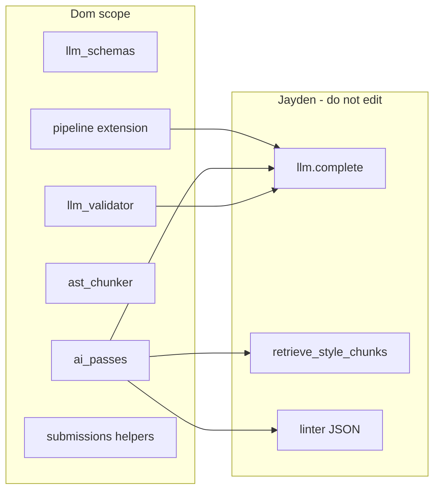

# Dom Milestone 3 — Meta Prompts Plan

## Scope boundary (non-negotiable)

**Dom may create or edit** (typical ownership under [docs/milestones/milestone-03-tasks.md](docs/milestones/milestone-03-tasks.md) Dom section):

- New modules: e.g. [`server/app/services/llm_schemas.py`](server/app/services/llm_schemas.py), [`server/app/services/llm_validator.py`](server/app/services/llm_validator.py), [`server/app/services/ai_passes.py`](server/app/services/ai_passes.py), [`server/app/services/ast_chunker.py`](server/app/services/ast_chunker.py)
- Extensions to Dom-owned orchestration: [`server/app/services/pipeline.py`](server/app/services/pipeline.py), [`server/app/services/submissions.py`](server/app/services/submissions.py) (persistence helpers Dom already owns)
- Dom-focused unit/integration tests under [`server/tests/`](server/tests/)

**Do not modify** (per your instruction):

- **Jayden:** [`server/app/services/llm.py`](server/app/services/llm.py) (except _reading_ `complete`, `redact`, `LLMResponse` if needed for typing—no edits), [`server/app/services/docker_client.py`](server/app/services/docker_client.py) / [`docker_runner.py`](server/app/services/docker_runner.py), [`sandbox_images.py`](server/app/services/sandbox_images.py), RAG ingester/retriever modules when Jayden adds them, Alembic migrations Jayden owns for pgvector, [`docs/deployment.md`](docs/deployment.md) linter-image sections owned by Jayden
- **Sylvie:** [`server/app/routers/submissions.py`](server/app/routers/submissions.py) review endpoint, Angular under [`client/`](client/), Sylvie-owned model migrations

**Integration rule:** Dom **imports and calls** Jayden’s surface API when it exists (e.g. `from app.services.llm import complete`, future `retrieve_style_chunks` from Jayden’s module). Until Jayden lands implementations, Dom’s tests **patch** `complete` / retrieval / linter entry points—**without editing Jayden’s source files**.

**Current anchor:** [`llm.complete`](server/app/services/llm.py) still raises `NotImplementedError` (line 85). Dom’s pipeline work should be structured so Pass 1–3 are testable with `AsyncMock` / fixtures until Jayden’s wrapper is live.

---

## Section A — Schema and validation (tasks 9–10 in traceability table)

### Meta prompt A1 — JSON schemas (`llm_schemas.py`)

Use this as the full instruction block for an implementing agent:

> You are implementing Milestone 3 for MAPLE A1, **Dom’s scope only**. Read [`docs/design-doc.md`](docs/design-doc.md) §4 (AI Integration / output shapes) and [`docs/milestones/milestone-03-tasks.md`](docs/milestones/milestone-03-tasks.md) Dom task “Define JSON schemas for each LLM pass output.” Create [`server/app/services/llm_schemas.py`](server/app/services/llm_schemas.py) exporting Python `dict` objects compatible with `jsonschema` (or the project’s chosen validator): **Pass 1** — test reconciliation with per-failure classifications (logic bug, environment, dependency, timeout, memory); **Pass 2** — style findings array (file path, line ranges, rule references, severity); **Pass 3** — MAPLE Standard Response Envelope with `criteria_scores` (0–100, level, justification, confidence, optional recommendations), `deterministic_score`, `metadata`, `flags`. **RecommendationObject** must require: file path, line range, original snippet, revised snippet, Git-style diff. Do not edit Jayden’s or Sylvie’s files. Add minimal unit tests that valid/invalid JSON instances pass/fail each schema.

### Meta prompt A2 — Validate and repair (`llm_validator.py`)

> Implement [`server/app/services/llm_validator.py`](server/app/services/llm_validator.py) with `validate_and_repair(raw_json: str, schema: dict, llm_complete_fn, repair_prompt: str) -> dict`: parse JSON; validate with the schema from `llm_schemas`; on failure, invoke **injected** `llm_complete_fn` once with a repair prompt including raw output and validation errors; if the second parse/validate fails, raise `EvaluationFailedError` (define in this module or a small `exceptions.py` under `services/` if needed). **Do not modify** [`server/app/services/llm.py`](server/app/services/llm.py). Unit-test with a mock `llm_complete_fn` that returns fixed strings for success and repair paths.

---

## Section B — Three-pass evaluation and AST chunking (tasks 11–14)

### Meta prompt B1 — Pass 1 (`ai_passes.py`)

> Add Pass 1 in [`server/app/services/ai_passes.py`](server/app/services/ai_passes.py): inputs = parsed test results from [`test_parser`](server/app/services/test_parser.py), rubric content, exit-code and resource metadata. Build system/user messages per design-doc §4 Pass 1. Call **`llm.complete`** with model `gemini-3.1-pro-preview` and **complex** timeout (60s) per M3 tasks—by passing parameters Dom controls (timeout policy may be enforced inside Jayden later; for now match the spec in your call signature / kwargs if `complete` accepts them, else document TODO on Jayden). Run output through `validate_and_repair` with Pass 1 schema. No style analysis. Mock `complete` in tests. Do not edit [`llm.py`](server/app/services/llm.py).

### Meta prompt B2 — AST chunker (`ast_chunker.py`)

> Implement [`server/app/services/ast_chunker.py`](server/app/services/ast_chunker.py): extract logical chunks (functions/classes/methods) per design-doc §3 §II; support **Python** via `ast` stdlib; **JavaScript/TypeScript** and **Java** via robust libraries or conservative regex fallback only if you document limitations—match milestone text expectations. Return typed `CodeChunk` objects (path, line range, text). Unit tests with fixture files under [`server/tests/`](server/tests/). No changes to Docker or sandbox images.

### Meta prompt B3 — Pass 2 (`ai_passes.py`)

> Implement Pass 2 in the same `ai_passes` module: **Skip** if `enable_lint_review` is false AND linter violations empty AND rubric does not require style review (encode conditions per design-doc §4). Otherwise: take Pass 1 reasoning object, AST chunks from `ast_chunker`, **call Jayden’s `retrieve_style_chunks` when available**—import from Jayden’s module without modifying it; until present, inject a callable in tests. Include linter violations JSON from Jayden’s pipeline hook—Dom accepts `list[dict] | None` as a parameter from orchestration. Model `gemini-3.1-flash-lite`, 30s timeout. Validate Pass 2 schema; append to shared object. Tests with mocks only.

### Meta prompt B4 — Pass 3 (`ai_passes.py`)

> Implement Pass 3: input = combined Pass 1+2 object (or Pass 1 only if Pass 2 skipped). System prompt per §4 Pass 3. Model `gemini-3.1-pro-preview`, 60s. Validate against Pass 3 / envelope schema. Enforce: emit `RecommendationObject` only when file path, line range, and snippet exist in evidence. Preserve uncertainty flags. Mock `complete` in tests.

---

## Section C — Flags, pipeline, persistence (tasks 15–17)

### Meta prompt C1 — `NEEDS_HUMAN_REVIEW` logic

> Implement pure functions (e.g. `compute_review_flags(...) -> tuple[list[str], bool]`) that set `NEEDS_HUMAN_REVIEW` in the `flags` array when: ambiguous rubric language (per model output fields), low confidence below configurable threshold, RAG `retrieval_status == "no_match"`, unsupported language / no style guide. Return whether submission should end as **`Awaiting Review`** vs **`Completed`**. Keep thresholds in config or module constants. Unit-test edge cases without DB.

### Meta prompt C2 — Extend [`pipeline.py`](server/app/services/pipeline.py)

> After deterministic score + initial `persist_evaluation_result` (M2 path), add an **`Evaluating`** phase: load assignment (`enable_lint_review`, rubric), run Pass 1 → conditional Pass 2 → Pass 3; apply `NEEDS_HUMAN_REVIEW` / status rules; on `EvaluationFailedError` set status to **`EVALUATION_FAILED`** (per M3 naming in tasks—align with existing `Submission.status` string conventions in DB). Update `metadata_json` to include `style_guide_version` when available from RAG metadata. **Call Jayden’s linter and RAG only via imported functions**—if missing, pass `None` / empty list and document. Do not modify Jayden’s implementation files. Use `update_evaluation_result` (next prompt) for `ai_feedback_json`. Broaden exception handling so LLM/schema failures map to the correct terminal status, not generic `Failed` unless spec says so.

### Meta prompt C3 — `persist_evaluation_result` / `update_evaluation_result` ([`submissions.py`](server/app/services/submissions.py))

> Extend [`persist_evaluation_result`](server/app/services/submissions.py) to accept optional `ai_feedback_json` (default `None` for M2 compatibility). Add `update_evaluation_result(db, submission_id, ai_feedback_json=..., metadata_json=...)` to merge-update the row after AI passes. Respect `DuplicateEvaluationError` behavior: AI update path should load existing row by `submission_id` if needed. Add focused async tests with in-memory SQLite or project test DB pattern. Do not touch Sylvie’s routers.

---

## Section D — Meta prompt for full Milestone 3 forensic audit (everyone)

### Meta prompt D1 — New audit document (no stale data)

> You are a senior auditor. **Do not** copy verdicts or evidence from prior audits. Read live code and [`docs/milestones/milestone-03-tasks.md`](docs/milestones/milestone-03-tasks.md) only. Produce a new file `audits/milestone-03-forensic-audit-YYYY-MM-DD.md` (today’s date) with: (1) Executive summary; (2) Task matrix for **all** rows in the M3 traceability table (tasks 1–25 + E2E): assignee, verdict (Pass / Partial / Fail / Blocked), and **file:line or test name** evidence; (3) Dependency map: what Dom’s pipeline needs from Jayden vs Sylvie; (4) Gap analysis (security, operational Docker/LLM keys, schema drift); (5) Test counts from actually running `pytest` or `unittest` with documented env; (6) Explicit statement if Jayden/Sylvie files were **not** modified during Dom’s work. Cross-check [`docs/api-spec.md`](docs/api-spec.md) and [`docs/design-doc.md`](docs/design-doc.md) §4/§8 for contract alignment.

---

## Suggested execution order

1. A1 → A2 (schemas before validator)
2. B2 (AST chunker can be parallel with A1)
3. B1 → B3 → B4 (pass order)
4. C1 → C3 → C2 (flags and persistence helpers before full pipeline wiring)
5. Run integration tests with mocks; then D1 when M3 is feature-complete

## Risk note

Dom’s pipeline **cannot fully integrate** until Jayden exposes working `complete()`, retrieval, and linter JSON. The meta prompts above assume **interface contracts** are agreed; if imports fail, Dom should use **protocols / dependency injection** at the `pipeline` boundary so Sylvie/Jayden files stay untouched.
