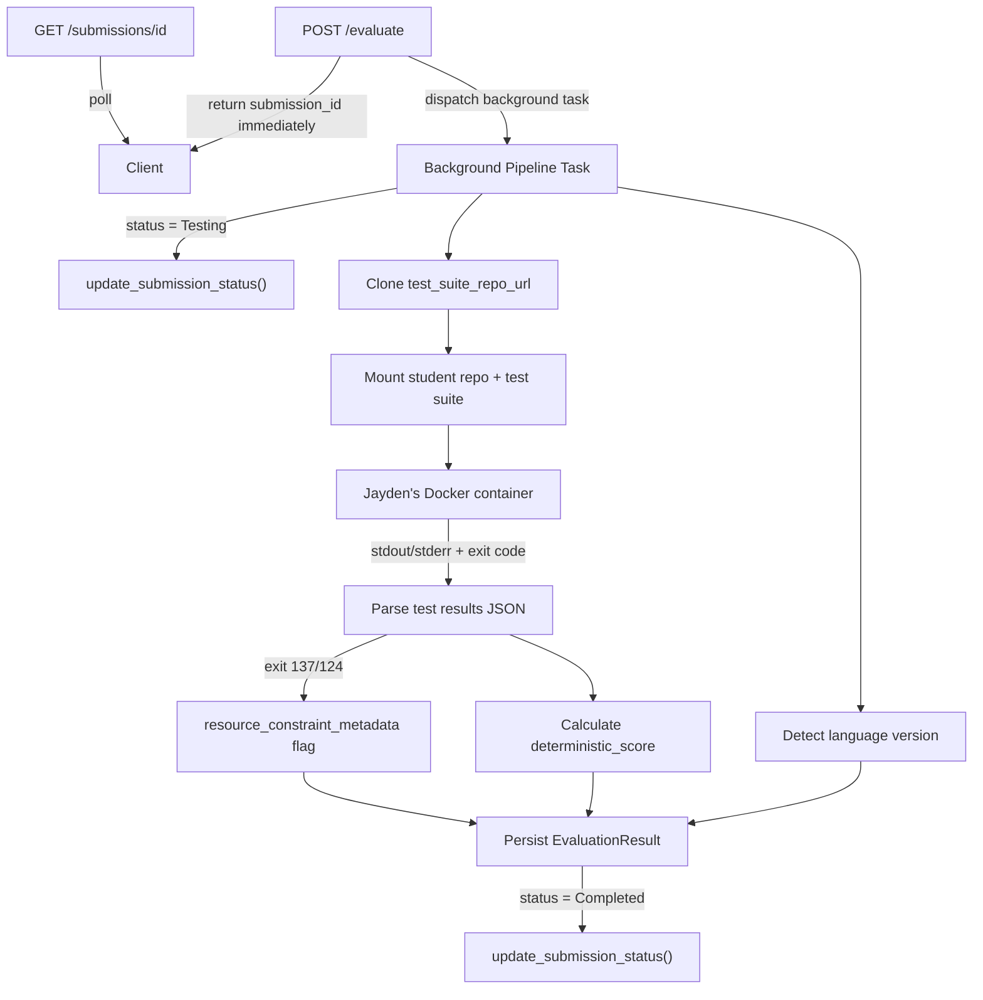

# Dom Milestone 2 — Implementation Plan and Meta Prompts

## Outputs

Two files will be created in `prompts/dev/dom/`:

- **`dom_milestone_2_plan.md`** — Detailed section-by-section implementation plan
- **`DomPrompt1Milestone2.md`** — Copy-paste-ready meta prompts for each section

---

## Existing Code Inventory (DO NOT overwrite)

These files exist from Milestone 1 and must not be replaced, only extended where noted:

- [server/app/models/submission.py](server/app/models/submission.py) — `Submission` ORM (status, assignment FK, evaluation_result relationship)
- [server/app/models/evaluation_result.py](server/app/models/evaluation_result.py) — `EvaluationResult` ORM (deterministic_score, ai_feedback_json, metadata_json)
- [server/app/models/assignment.py](server/app/models/assignment.py) — `Assignment` ORM (test_suite_repo_url, language_override, enable_lint_review)
- [server/app/services/submissions.py](server/app/services/submissions.py) — `create_submission`, `get_submission_by_id`, `update_submission_status`
- [server/app/services/assignments.py](server/app/services/assignments.py) — `get_assignment_by_id`, `validate_assignment_exists`
- [server/app/services/llm.py](server/app/services/llm.py) — `redact()`, `redact_dict()`, M3 stubs
- [server/app/routers/submissions.py](server/app/routers/submissions.py) — `GET /submissions/{id}` with `_can_view_submission` RBAC, eager-loaded `evaluation_result` and `assignment`
- [server/app/main.py](server/app/main.py) — `POST /evaluate` handler (synchronous clone+cache, lines 431-620)
- [server/app/utils/responses.py](server/app/utils/responses.py) — `success_response()`, `error_response()` MAPLE envelope helpers

---

## Pipeline Data Flow (M2)



---

## Section Breakdown

### Section A — Test Suite Injection and Async Dispatch (Tasks 7, 12)

**New files to create:**

- `server/app/services/pipeline.py` — Orchestrator: clones test suite, calls Docker client, invokes parsers, persists result, manages status transitions
- `server/app/services/docker_client.py` — Abstraction over Jayden's Docker SDK (volume mounts, container start, output capture); easily mockable interface

**Files to modify (additive only):**

- `server/app/main.py` — After the existing `create_submission()` calls (lines ~541 and ~600), add `asyncio.create_task(run_pipeline(...))` dispatch; import the pipeline function
- `server/app/services/submissions.py` — No changes needed (already has `update_submission_status`)

**Key design decisions:**

- Use `asyncio.create_task()` over `BackgroundTasks` so the pipeline runs within the same event loop and can use the async DB session factory
- The pipeline function gets its own DB session (new `async_session_maker()` call) since the request session closes after the response
- Status lifecycle: `Pending` (at create) -> `Testing` (pipeline start) -> `Completed` (success) or `Failed` (any exception)
- Test suite cloning reuses the existing `clone_repository()` from main.py, targeting a separate staging path for the instructor test repo

**Test file:** `server/tests/test_pipeline.py`

- Mock `docker_client` to return fixture stdout/stderr
- Verify status transitions: `Pending -> Testing -> Completed`
- Verify failure path: `Pending -> Testing -> Failed`
- Verify test suite clone is called with `assignment.test_suite_repo_url`

---

### Section B — Test Result Capture and Language Detection (Tasks 8, 9)

**New files to create:**

- `server/app/services/test_parser.py` — Parse container stdout/stderr into structured JSON; framework-aware parsers for pytest, JUnit, Jest; handle build failure, no-tests, unrecognized framework; map exit codes 137/124 to `resource_constraint_metadata`
- `server/app/services/language_detector.py` — Read `pyproject.toml`, `pom.xml`, `package.json`, `CMakeLists.txt` from a repo path; extract version; respect `language_override` from Assignment; return structured `{language, version, source}` dict

**Output schema for test_parser:**

```python
{
    "framework": "pytest" | "junit" | "jest" | "unknown",
    "passed": int,
    "failed": int,
    "errors": int,
    "skipped": int,
    "tests": [
        {"name": "test_foo", "status": "passed" | "failed" | "error", "message": str | None}
    ],
    "resource_constraint_metadata": {
        "exit_code": int,
        "oom_killed": bool,
        "timed_out": bool
    } | None,
    "raw_output_truncated": bool
}
```

**Output schema for language_detector:**

```python
{
    "language": "python" | "java" | "javascript" | "typescript" | "cpp" | "unknown",
    "version": str | None,
    "source": "pyproject.toml" | "package.json" | "pom.xml" | "CMakeLists.txt" | "language_override",
    "override_applied": bool
}
```

**Test files:**

- `server/tests/test_test_parser.py` — Fixture strings for pytest output (pass, fail, error, empty), JUnit XML, Jest JSON; exit code 137/124 handling
- `server/tests/test_language_detector.py` — Fixture config files for each language; override takes precedence; missing file returns `unknown`

**No cross-section dependencies.** Both modules take plain strings/paths as input and return dicts. Fully unit-testable.

---

### Section C — Deterministic Scoring and Persistence (Tasks 10, 11)

**New files to create:**

- `server/app/services/scoring.py` — `calculate_deterministic_score(test_results: dict, rubric_content: dict) -> float` maps pass/fail ratio to rubric point weights, returns 0-100 score

**Files to modify (additive only):**

- `server/app/services/submissions.py` — Add `persist_evaluation_result(db, submission_id, deterministic_score, metadata_json)` that creates and commits an `EvaluationResult` row

**Scoring logic:**

- If rubric has weighted criteria: distribute points proportionally by test-to-criterion mapping
- Default fallback: simple `(passed / total) * 100` when no rubric weights exist
- Edge cases: 0 total tests = score 0; all errors = score 0

**metadata_json schema to persist:**

```python
{
    "language": {...},           # from language_detector
    "exit_code": int | None,
    "resource_constraint_metadata": {...} | None,  # from test_parser
    "test_summary": {"passed": int, "failed": int, "errors": int, "skipped": int},
    "ai_feedback_json": None    # left null for M2
}
```

**Test file:** `server/tests/test_scoring.py`

- All pass = 100, all fail = 0, mixed = proportional, zero tests = 0
- Rubric-weighted vs unweighted paths

---

### Section D — GET /submissions/{id} Verification (Task 13)

**Current state analysis:** The endpoint at [server/app/routers/submissions.py](server/app/routers/submissions.py) already:

- Eagerly loads `evaluation_result` (line 54)
- Returns `evaluation.deterministic_score` and `evaluation.ai_feedback` when `evaluation_result` is not None (lines 83-87)
- Omits the `evaluation` key entirely when `evaluation_result` is None (implicit — it's only added in the `if` block)
- Has RBAC via `_can_view_submission` (student owner, instructor of assignment, admin)

**What may need changing:**

- Verify the response shape matches [docs/api-spec.md](docs/api-spec.md) section 7 (both with-evaluation and without-evaluation variants)
- Ensure `status` field reflects the new lifecycle values (`Testing`, `Completed`, `Failed`) in addition to existing values
- Add `metadata_json` to the evaluation response if the spec requires it

**Test file:** `server/tests/test_submissions_router.py` (extend existing)

- Add test for submission without evaluation (no `evaluation` key in response)
- Add test for submission with evaluation (includes `deterministic_score`, `ai_feedback` null)
- Existing RBAC tests already cover authorization paths

---

## Meta Prompt Structure

Each section's meta prompt in `DomPrompt1Milestone2.md` will follow this format (mirroring [prompts/dev/dom/domPrompt1.md](prompts/dev/dom/domPrompt1.md)):

- **Objective** — What the section delivers
- **Inputs to use** — Reference documents with specific section callouts
- **Files to create** — Exact paths and responsibilities
- **Files to modify** — Exact paths with change description
- **Files NOT to modify** — Explicit exclusion list
- **Acceptance criteria** — Concrete verification steps
- **Constraints** — MAPLE envelope, UUIDs, relative imports, no cross-owner overwrites
- **Dependencies** — What to mock for isolated testing vs what needs Jayden's runtime

---

## File Summary

| New file                                   | Section | Purpose                             |
| ------------------------------------------ | ------- | ----------------------------------- |
| `server/app/services/pipeline.py`          | A       | Background pipeline orchestrator    |
| `server/app/services/docker_client.py`     | A       | Docker SDK abstraction layer        |
| `server/app/services/test_parser.py`       | B       | Container output to structured JSON |
| `server/app/services/language_detector.py` | B       | Repo language/version detection     |
| `server/app/services/scoring.py`           | C       | Test results to 0-100 score         |
| `server/tests/test_pipeline.py`            | A       | Pipeline orchestration tests        |
| `server/tests/test_test_parser.py`         | B       | Parser fixture tests                |
| `server/tests/test_language_detector.py`   | B       | Language detection tests            |
| `server/tests/test_scoring.py`             | C       | Scoring logic tests                 |
| `prompts/dev/dom/dom_milestone_2_plan.md`  | —       | This plan                           |
| `prompts/dev/dom/DomPrompt1Milestone2.md`  | —       | Meta prompts                        |
